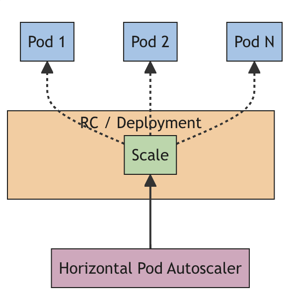
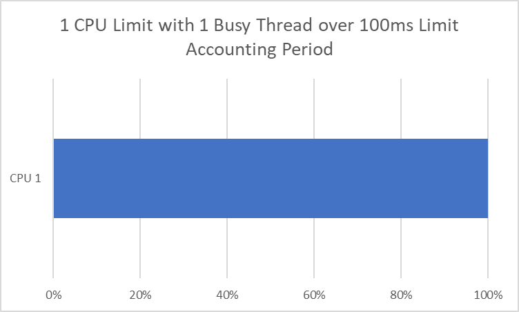
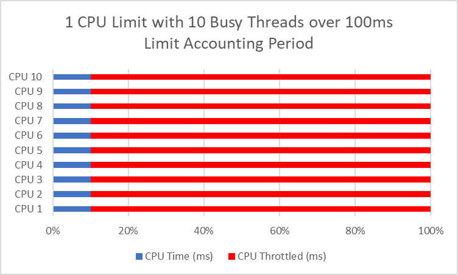
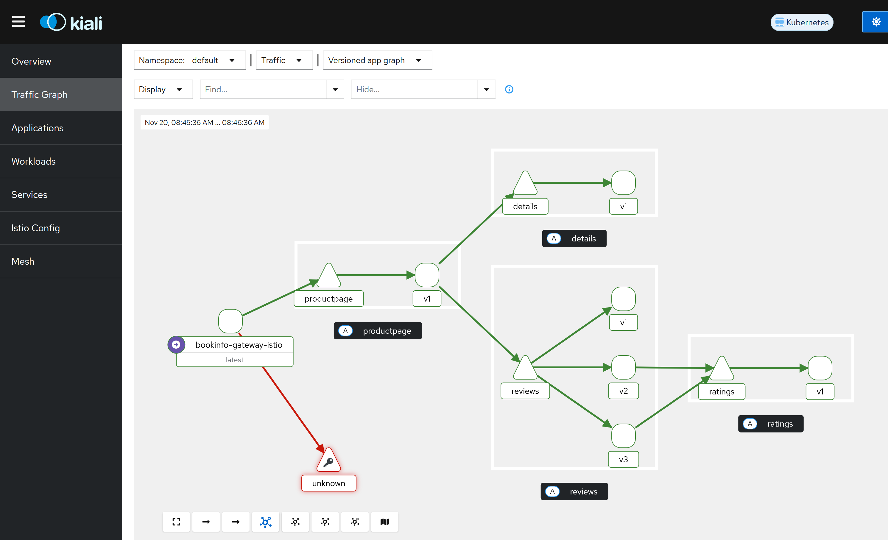
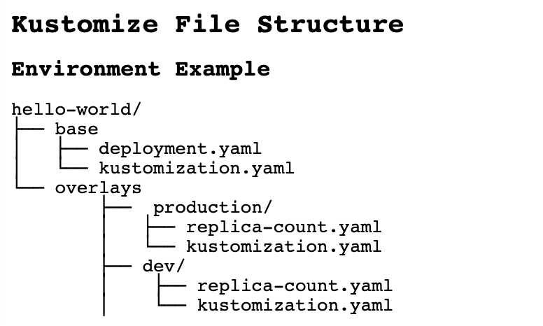
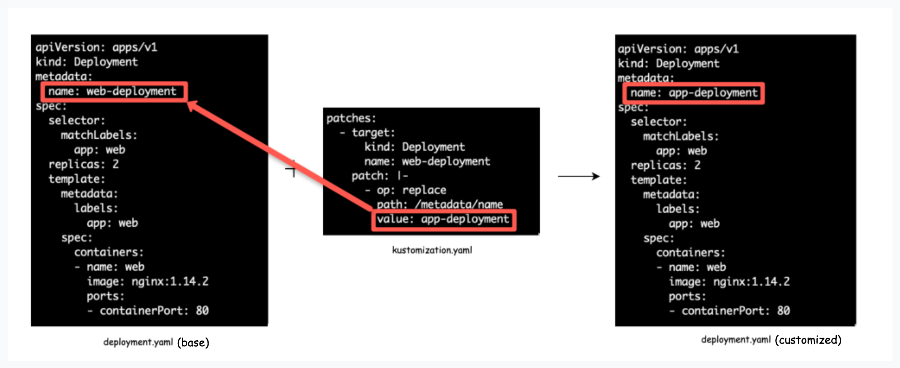
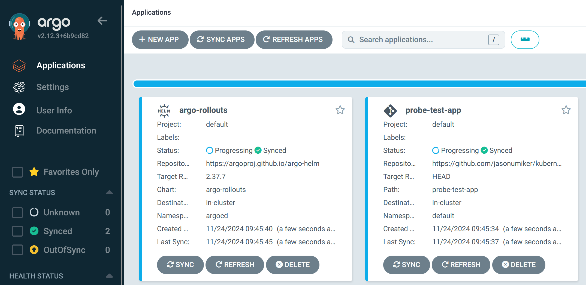
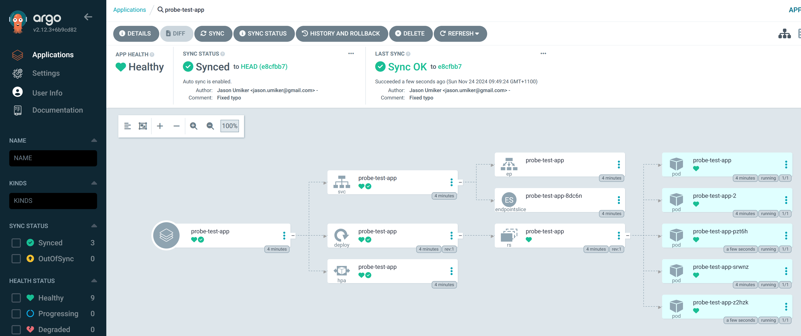
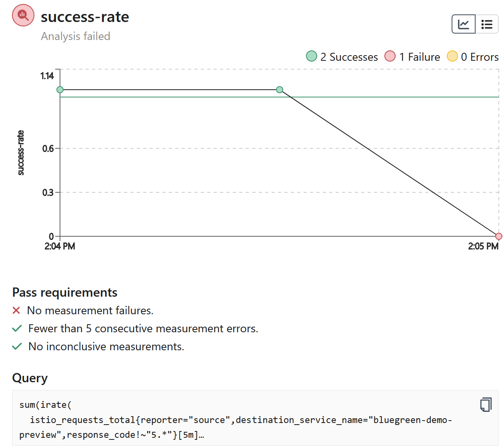

# Kubernetes Training

This set of general Kubernetes training materials was designed to run on the Kubernetes that is part of Docker Desktop on a Mac or Windows machine. It should actually run on *any* Kubernetes - but it hasn't been documented/tested outside of Docker Desktop. On Windows it will require not just Docker Desktop but also WSL2 (where everything here should be run).

## Table of Contents
- [Kubernetes Training](#kubernetes-training)
  - [Table of Contents](#table-of-contents)
  - [Prerequisites](#prerequisites)
  - [Pods, Probes, Services, ReplicaSets, Deployments and StatefulSets](#pods-probes-services-replicasets-deployments-and-statefulsets)
    - [A Pod](#a-pod)
    - [A Service](#a-service)
    - [Probes](#probes)
    - [ReplicaSets](#replicasets)
    - [Deployments](#deployments)
    - [Quarantine a Pod (by removing the label from it that the operators are selecting it on)?](#quarantine-a-pod-by-removing-the-label-from-it-that-the-operators-are-selecting-it-on)
    - [Sidecar and Init containers within a Pod](#sidecar-and-init-containers-within-a-pod)
    - [PersistentVolumes, PersistentVolumeClaims and StorageClasses](#persistentvolumes-persistentvolumeclaims-and-storageclasses)
    - [StatefulSets](#statefulsets)
    - [DaemonSets](#daemonsets)
  - [Requests, Limits and Scaling Pods](#requests-limits-and-scaling-pods)
    - [First let's install Prometheus for Metrics/Monitoring](#first-lets-install-prometheus-for-metricsmonitoring)
    - [The Horizontal Pod Autoscaler (HPA)](#the-horizontal-pod-autoscaler-hpa)
    - [CPU and Memory Requests](#cpu-and-memory-requests)
    - [CPU and Memory Limits - and how misconfiguring them can really hurt your performance and availability](#cpu-and-memory-limits---and-how-misconfiguring-them-can-really-hurt-your-performance-and-availability)
    - [Kubernetes Event-driven Autoscaling (KEDA)](#kubernetes-event-driven-autoscaling-keda)
  - [Jobs and CronJobs](#jobs-and-cronjobs)
  - [Kubernetes Namespaces and API Authorization (via Roles/ClusterRoles)](#kubernetes-namespaces-and-api-authorization-via-rolesclusterroles)
  - [Ingress](#ingress)
    - [What is 'wrong' with Ingress for it to need to be eventually replaced (by Gateway)?](#what-is-wrong-with-ingress-for-it-to-need-to-be-eventually-replaced-by-gateway)
  - [Gateway](#gateway)
  - [Istio](#istio)
    - [Carefully consider whether you need a Service Mesh like Istio](#carefully-consider-whether-you-need-a-service-mesh-like-istio)
  - [Kustomize and Helm](#kustomize-and-helm)
    - [Kustomize](#kustomize)
    - [Helm](#helm)
    - [What is a Custom Resource Definition (CRD)?](#what-is-a-custom-resource-definition-crd)
  - [Controllers/Operators](#controllersoperators)
    - [Admission Controllers / OPA Gatekeeper](#admission-controllers--opa-gatekeeper)
  - [GitOps with Argo CD](#gitops-with-argo-cd)
  - [Progressive Delivery with Argo Rollouts](#progressive-delivery-with-argo-rollouts)
  - [Kubernetes Pod Security / Multi-tenancy Considerations](#kubernetes-pod-security--multi-tenancy-considerations)
    - [Why is this a concern?](#why-is-this-a-concern)
    - [How to strengthen pod-level security?](#how-to-strengthen-pod-level-security)
  - [Other topics that we didn't cover because Docker Desktop's K8s is not suitable for exploring them](#other-topics-that-we-didnt-cover-because-docker-desktops-k8s-is-not-suitable-for-exploring-them)

## Prerequisites
1. Download and Install [Docker Desktop](https://www.docker.com/products/docker-desktop/)
1. On Windows, install [Ubuntu on Windows Subsystem for Linux (WSL) v2](https://documentation.ubuntu.com/wsl/en/latest/guides/install-ubuntu-wsl2/)
  1. You also will need to ensure your Ubuntu user in in the docker group by running `sudo usermod -aG docker $USER` and `newgrp docker`
1. Open Settings (the gear icon in the upper right) and then enable Kubernetes 
  1. Note that if you ever 'mess up' this cluster you can just click that red Reset Kubernetes Cluster and it'll quickly go back to default settings - it's your 'get out of jail free card'!
1. On Windows, while still in Settings, go to Resources then WSL Integration and make sure it is turned on for Ubuntu
1. Install Homebrew (on either Mac or Ubuntu WSL2 - if you do not have it installed already) - `/bin/bash -c "$(curl -fsSL https://raw.githubusercontent.com/Homebrew/install/HEAD/install.sh)"`
   1. Note that there is a `Next steps:` section at the end of that install script - make sure you do those to or it won't be in your path etc.
1. Install Helm via Homebrew with a `brew install helm`
1. Install Kustomize via Homebrew with a `brew install kustomize`
1. Install [k9s](https://k9scli.io/) via Homebrew with a `brew install derailed/k9s/k9s`
1. Install the Argo Rollouts CLI with a `brew install argoproj/tap/kubectl-argo-rollouts`
1. Install git (if it's not already)
  1. On Mac, it should already be there if you have installed XCode and/or its Command Line Tools (which are a prerequisite for Homebrew so it should have installed them)
  1. On WSL2 Ubuntu on Windows it should be already there by default
1. Run `git clone https://github.com/jasonumiker/kubernetes-training.git`
1. Make sure your kubeconfig is pointed at docker-desktop:
  1. Run `echo $KUBECONFIG` - you should see `~/.kube/config`
    1. If you don't then run `export KUBECONFIG=~/.kube/config` which will point you there for the remainder of this Terminal session
  1. Then run `kubectl config get-contexts` and you should see
    ```
    CURRENT   NAME             CLUSTER          AUTHINFO         NAMESPACE
    *         docker-desktop   docker-desktop   docker-desktop   

    ```
  1. And/or run `kubectl get nodes` and you should see
    ```
    NAME             STATUS   ROLES           AGE   VERSION
    docker-desktop   Ready    control-plane   10s   v1.30.2
    ```
  1. If you don't see this then I'd suggest these troubleshooting steps:
    1. Doing a `mv ~/.kube/config ~/.kube/config.old` and then restarting Docker Desktop (for it to create your KUBECONFIG from fresh)
    1. Go to Troubleshooting in Docker Desktop and click the `Clean/Purge Data` button (to fully restore the whole Linux VM to fresh)
    1. Double-check your KUBECONFIG is set to the right/default path by running `echo $KUBECONFIG`

## Pods, Probes, Services, ReplicaSets, Deployments and StatefulSets
In this section you'll learn about:
* [Pods](https://kubernetes.io/docs/concepts/workloads/pods/) - including how Kubernetes ensures they are healthy and ready for traffic via [Probes](https://kubernetes.io/docs/tasks/configure-pod-container/configure-liveness-readiness-startup-probes/)
* [Services](https://kubernetes.io/docs/concepts/services-networking/service/) - which is how to expose them outside your cluster and load-balance them
* [ReplicaSets](https://kubernetes.io/docs/concepts/workloads/controllers/replicaset/) - which is how to scale them out as many 'replica' Pods as you need as well as scale them back in when you no longer need as many
* [Deployments](https://kubernetes.io/docs/concepts/workloads/controllers/deployment/) - which is how we deploy new version/tags of our apps via a new ReplicaSet alongside the existing one and gradually scale it out and the old version down until you're 100% on the new version
* [StatefulSets](https://kubernetes.io/docs/concepts/workloads/controllers/statefulset/) - which is how we deploy stateful workloads that need consistent naming/DNS and to be reconnected to their [PersistentVolumes](https://kubernetes.io/docs/concepts/storage/persistent-volumes/).
* [DaemonSets](https://kubernetes.io/docs/concepts/workloads/controllers/daemonset/) - which is how we can say we want to deploy something once on every Node in the cluster

### A Pod
Have a look at the PodSpec at [probetest-testapp/probe-test-app-pod.yaml](probe-test-app/probe-test-app-pod.yaml). You'll see the following:
```
apiVersion: v1 #Everything in K8s has to set an explicit apiVersion
kind: Pod #It is a Pod we're creating
metadata:
  name: probe-test-app #Each object has a name
  labels: #But also usually Labels (key:value like AWS Tags)
    app.kubernetes.io/name: probe-test-app #See below re: the common label(s)
spec:
  containers: #We want one or more containers
  - name: probe-test-app #In this case just the one - probe-test-app
    image: jasonumiker/probe-test-app:v1 #With this image:tag
    ports:
    - containerPort: 8080 #On port 8080
    resources:
      requests:
        cpu: 50m #Which needs at least 5% of one core CPU (50/1000)
        memory: 52Mi #And 52 Megabytes of RAM
```
On the subject of labels, the name can't be used in a Label selector for things like Services (which you'll see next). So, we need a label for it as well. It was common to use the 'app' label but recently Kubernetes has formalized these into a series of app.kubernetes.io/ labels as described [here](https://kubernetes.io/docs/concepts/overview/working-with-objects/common-labels/).

And we'll look more closely at the Probes in a moment. And a bit more on CPU/Memory Requests and Limits later on as well.

Let's launch this Pod:
* cd into probe-test-app
* Run `kubectl apply -f probe-test-app-pod.yaml`
* Run `kubectl get pods -o wide` - note that you can't get to the Pod's IP which is an overlay network without going through the Node (a local Linux VM running Docker and Kubernetes) or the K8s API

Kubernetes will let us tunnel right to the Pod IP by forwarding a port on our host machine through to it though:
`kubectl port-forward pod/probe-test-app 8080:8080`

Then open http://localhost:8080 in your browser and you'll see the app served by this Pod.

NOTE: You are tunneling *through* the Kubernetes control plane to the Pod. So even if you can't reach the Pod directly (such as in a production environment where a firewall actively prevents it) if you can reach the K8s control plane, and it allows you to port-forward, then you can reach it that way using its access/connectivity to it.

Once you're done you can ctrl-c out of that port-forward in your terminal.

If you wanted to get an interactive shell within the Pod you can do that via the control plane as well:
* `kubectl exec -it probe-test-app -- /bin/bash` - open an interactive bash shell within the pod probe-test-app
* `whoami` - this container is running as the user python
* `ps aux` - I can only see the processes within the container's Linux Namespace
* `exit` - exit back to our Terminal

### A Service
But normally we don't want to go directly to individual Pods. We want a load balancer - and one that bridges the wider corporate network or Internet and our cluster's network in a controlled way.

Kubernetes has a built-in layer 4 loadbalancer in Services.

Let's have a look at an example of a Service at [probe-test-app/probe-test-app-service.yaml](probe-test-app/probe-test-app-service.yaml)
```
apiVersion: v1
kind: Service
metadata:
  name: probe-test-app
spec:
  ports:
  - name: 8000-tcp #We want to take traffic in on 8000
    port: 8000
    protocol: TCP
    targetPort: 8080 #And our target Pod(s) are listening on 8080
  selector:
    app.kubernetes.io/name: probe-test-app #And our target Pods have this label
  type: LoadBalancer #More about the various types below
```
There are several types of services:
* ClusterIP - given an IP that is only reachable by Pods within the Cluster
* NodePort - this assigns a port on each and every Node in the cluster that will route through to this Pod (even if it isn't on the Node)
* LoadBalancer - this sets up a LoadBalancer external to Kubernetes to front this service (e.g. AWS NLB)

In the case of Docker Desktop they've mapped the LoadBalancer Service type to your laptop's localhost for convenience.

Deploy the service by running `kubectl apply -f probe-test-app-service.yaml`

You can see the details by running `kubectl get services -o wide`. You'll see that:
* The probe-test-app service is of a LoadBalancer type 
* With an EXTERNAL-IP (usually the DNS address of the external load balancer you should be able to reach it on) of localhost 
* And that it is actually mapping port 8000 on the LoadBalancer through a random NodePort in the 30000-ish range on its way in.
    * You can just ignore that and use the http://localhost:8000 and ignore that though - thanks Docker Desktop!
* That it is pointing at any Pods (it's Selector) with the label `app.kubernetes.io/name=probe-test-app`

If you run `kubectl get endpoints` you'll see the Pod IP there as the only endpoint of the service (you can see the Pod IP to verify it is what you see with `kubectl get pods -o wide`).

To see that in action we can add a 2nd Pod with that label by running `kubectl apply -f probe-test-app-pod-2.yaml`

If you re-run `kubectl get endpoints` you'll now see the 2nd Pod has been added as an endpoint for the service.

And if you go to http://localhost:8000 in your browser and refresh you'll see that the name changes in what Pod that you're served from (that you are balanced between them). Note that the hostname the Pod sees is its Pod name - and I am just having it return that hostname out this web app.

One last thing to note about Services is that Kubernetes creates a DNS record for them in a naming convention that allows for easy and predictable discovery of them by other Pods running within the same cluster. The naming convention is `service-name.namespace-name.svc.cluster.local`. You'll see this convention used later on in the init containers example below. Note that this only applies within a Pod - you can't use this convention outside the cluster or between clusters.

### Probes
You may have noticed in the Pod settings that we've defined both of the types of Probes - readiness and liveness.

```
    livenessProbe:
      httpGet:
        path: /livez
        port: 8080
      initialDelaySeconds: 0
      periodSeconds: 10
      timeoutSeconds: 1
      successThreshold: 1
      failureThreshold: 3
    readinessProbe:
      httpGet:
        path: /readyz
        port: 8080
      initialDelaySeconds: 0
      periodSeconds: 10
      timeoutSeconds: 1
      successThreshold: 1
      failureThreshold: 3
```

You don't have to put all of those settings but I wanted to put them all explicitly on what they default to so that you can see what options are available and what their defaults are. You can learn more about them in the K8s documentation [here](https://kubernetes.io/docs/tasks/configure-pod-container/configure-liveness-readiness-startup-probes/#configure-probes)

In short, the livenessProbe controls whether a Pod should be restarted due to it being unhealthy (as an attempt to heal it) vs. the readinessProbe which is used to decide whether a Service should send it traffic or not. In AWS these two things are often combined - but separating them into different endpoints and behaviors can be very useful.

The app that you go to on http://localhost:8000 not only tells you if each of these is healthy but it also lets you toggle them between behind healthy and unhealthy.

If you click the button to toggle the livenessProbe then you'll see the container restart - and this app defaults to it behind Healthy so that will 'heal' it. As you can see in the settings above it does the probe every 10 seconds and in order to be restarted it needs to fail it 3 times - so be unhealthy for 30 seconds all up.

To see this in action click the **Toggle Liveness** button. Then run `kubectl get pods -w` and watch for it to restart (press ctrl-c to stop)

To see the readinessProbe in action click the **Toggle Readiness** button. If you refresh http://localhost:8000 after 30 second you'll see it no longer balances you between the two pods but, instead, is only sending you to the Pod that is still passing its readinessProbe.

Unlike the livenessProbe this won't automatically heal - you can heal it by connecting directly to the Pod and clicking the Toggle button again. As we saw you can do that by running:
* `kubectl get pods` - note which of the two has a 0/1 for READY
* `kubectl port-forward pod/probe-test-app(-2) 8001:8080` - Point the port-forward at the not ready Pod Name so that you can go to port 8081 on your laptop to reach it directly (bypassing the Service that won't send you there any longer)
* Click the **Toggle Readiness** button again to 'heal' the service.
* Press ctrl-c to exit the port-forward
* Refresh http://localhost:8000 and see the traffic start to load balance between the two again

Alternatively you could have deleted the Pod and recreated it to heal it (`kubectl delete pod probe-test-app-2 && kubectl apply -f probe-test-app-pod-2.yaml`) - but, since this Pod isn't managed by a ReplicaSet, you would have had to recreate it yourself. Let's look at how a ReplicaSet can help do that for us next.

### ReplicaSets
First, lets delete our two Pods. Since they are the only two that are running in the default Namespace so far we can run `kubectl delete pods --all` to delete them both.

Now we're going to let a ReplicaSet create them for us. Let's have a look at the ReplicaSet YAML spec at [probe-test-app/probe-test-app-replicaset.yaml](probe-test-app/probe-test-app-replicaset.yaml)

```
apiVersion: apps/v1
kind: ReplicaSet
metadata:
  name: probe-test-app #Name of our ReplicaSet
  labels:
    app.kubernetes.io/name: probe-test-app #Label of our ReplicaSet
spec:
  replicas: 3
  selector:
    matchLabels:
      app.kubernetes.io/name: probe-test-app #Label on Pods so it thinks it manages them
  template:
    metadata:
      labels:
        app.kubernetes.io/name: probe-test-app #Label it puts on Pods it creates (should match selector)
    spec:
      containers: #From here on very similar to PodSpec - as it is a template for the Pods it creates
        - name: probe-test-app
          image: jasonumiker/probe-test-app:v1
          ports:
            - containerPort: 8080
          resources:
            requests:
              cpu: 50m
              memory: 52Mi
          livenessProbe:
            httpGet:
              path: /livez
              port: 8080
          readinessProbe:
            httpGet:
              path: /readyz
              port: 8080

```

To see it in action you can run `kubectl apply -f probe-test-app-replicaset.yaml`

You'll now see three Pods running with five random characters appended to each.

You can scale this in to two Pods by running `kubectl scale replicaset probe-test-app --replicas=2` - then check with a `kubectl get pods`

And you can add tools to automatically scale it in and out for you, such as the [Horizontal Pod Autoscaler](https://kubernetes.io/docs/tasks/run-application/horizontal-pod-autoscale/) or [KEDA](https://keda.sh/), as well. We'll cover those in later sections.

### Deployments
So ReplicaSets help us out abstracting the management and scaling of Pods a bit. But when we want to deploy a new version we ideally want to manage two ReplicaSets - one with the old version and one with the new one. And, for a big Deployment, to scale the old down and the new up gradually so it doesn't require us to run double the services during the cutover etc.

That is where Deployments come in.

You can remove the ReplicaSet by running `kubectl delete replicaset probe-test-app`. We'll replace it with a Deployment.

If you look at the Deployment YAML spec at [probe-test-app/probe-test-app-deployment.yaml](probe-test-app/probe-test-app-deployment.yaml) it is nearly identical to the ReplicaSet one. The difference comes when you update a Deployment vs. a ReplicaSet.

Run `kubectl apply -f probe-test-app-deployment.yaml` to see this in action.

If you run `kubectl get pods` you get the first clue there is a difference - it is't just the random 5 characters appended on the name but another random 9 appended before that one. That is because the Deployment manages ReplicaSets with a random name which manages Pods with a random name. If you run `kubectl get replicasets` you'll see that the 9 digits is indeed the one it appended on the ReplicaSet it created.

Now let's say we wanted to upgrade our app to v2 and see what happens. To do so we'd run: 
* `kubectl set image deployment/probe-test-app probe-test-app=jasonumiker/probe-test-app:v2`
* Then quickly run `kubectl get replicasets -w` - you'll see the new ReplicaSet gradually have its DESIRED increased and the old one have its decreased all the way to zero.
* Once you've seen that ctrl-c out of that
* If you run `kubectl events` you can see the scaling actions the Deployment was taking there

You can customize many aspects of this upgrade behavior (how aggressive, fast or automatic it is etc.) as documented [here](https://kubernetes.io/docs/concepts/workloads/controllers/deployment/#strategy)

Finally, let's say this was bad and we want to roll it back. You simply run `kubectl rollout undo deployment/probe-test-app` - which will scale the new version ReplicaSet down and the old version back up (since it is still there at 0). It actually leaves the last 10 versions there by default - though you can customize this with `.spec.revisionHistoryLimit`

### Quarantine a Pod (by removing the label from it that the operators are selecting it on)?
One interesting common thread with Services and ReplicaSets have in common is that they are looking for Pods with certain label(s).

If you take a pod and remove the label that they are looking for (which is often the same for both) then it will stop getting Service traffic and/or it won't be killed by the ReplicaSet (which feels that it is no longer managing it). The ReplicaSet will add another one to 'replace' it since it doesn't see it any longer as well.

To see this in action:
* Run `kubectl get pods` and copy the name of one of the probe-test-app Pods
  * If there aren't any running do a `kubectl apply -f probe-test-app-deployment.yaml` and a `kubectl apply -f probe-test-app-service.yaml` to ensure both are running
* Run `kubectl label pod [copied pod name] app.kubernetes.io/name-` as if you put a minus sign after the label it in a `kubectl label` command it removes it
* Run `kubectl get pods` and note that the ReplicaSet launched another one because it doesn't include the one that we re-labeled in its list anymore. 
  * Since this is the same label we used for the Service it also would have stopped getting traffic from that at the same time too...
* Run `kubectl describe replicaset probe-test-app` and see the details of its action from its perspective there too

### Sidecar and Init containers within a Pod
A Pod is made up of one or more containers. The containers section is a sequence/array and you can just specify more of them. When you specify more than one container in the Pod, the additional ones are called [Sidecar Containers](https://kubernetes.io/docs/concepts/workloads/pods/sidecar-containers/).

These containers are:
* Scheduled together on the same Node
  * So, they always scale in/out together in ReplicaSets etc.
* Put in the same Linux Namespace / Security Boundary so that:
  * They be configured to see each other's processes - see [here](https://kubernetes.io/docs/tasks/configure-pod-container/share-process-namespace/)
  * They share the same network interface and IP address
    * This means they can run their services on different ports on their shared network interface/IP and reach each other on localhost on their respective ports
  * They share the same storage Namespace and can share [emptyDir Volumes](https://kubernetes.io/docs/concepts/storage/volumes/#emptydir) between each other (these exist just to have an ephemeral Volume to share some data between containers in the same Pod)

And there is also a special type of additional container called [Init Containers](https://kubernetes.io/docs/concepts/workloads/pods/init-containers/) that run before the other container(s) in the Pod and can contain utilities or setup scripts not present in an app image (e.g. to load the schema into an empty database that the app expects to be there etc.). These:
 * Always run to completion (rather than stay running all the time like the main or sidecar containers)
 * Each init container in the YAML sequence/array must complete successfully before the next one starts (so you can count on that ordering)

First, we have a sidecar container example. In this example there is an 'app' container which is generating a log file. That is being written to a shared emptyDir Volume that is also mounted in our 'sidecar' container. That, in turn, is running nginx to share the contents of this log file out on port 80. This is meant to represent a logging sidecar that maybe would send the logs on to Splunk etc. instead. To see this in action:
* `cd ../sidecar-and-init-containers`
* `kubectl apply -f sidecar.yaml`
* `kubectl exec pod-with-sidecar -c sidecar-container -it bash` - connect to the sidecar container within the Pod
* `apt-get update && apt-get install curl` - install curl within that sidecar
* `curl 'http://localhost:80/app.txt'` - access the log file via the sidecar's nginx service
* `exit` to exit out of our interactive kubectl exec session

Next, we have an init container example. In this example we will only start our main application once two Kubernetes Services exist. We have two different initContainers which check for each of these two services.
* `kubectl apply -f init.yaml`
* `kubectl get pod myapp-pod` - you'll see it is waiting on the first init container to be successful
* `kubectl apply -f services-init-requires.yaml` - create those services it is looking for
* `kubectl get pod myapp-pod -w` - quickly do a kubectl get with a -w to watch/follow the output
* Once you see the initContainers succeed and the Pod go to Running you can ctrl-c to exit the -w
* `kubectl delete pod myapp-pod`, `kubectl delete pod pod-with-sidecar`, `kubectl delete service myservice` and `kubectl delete service mydb` to clean this all up

### PersistentVolumes, PersistentVolumeClaims and StorageClasses
Deployments are great for stateless workloads - but some workload on Kubernetes require state. The way that Kubernetes does this is that it allows Pods to ask for PersistentVolumes - which usually map through to things like EBS Volumes in AWS or Persistent Disks in GCP etc.

Kubernetes hands the creation, updating and deletion of these volumes out on the cloud or in your SAN to a Container Storage Interface (CSI) driver. Appropriate CSI drivers will usually be installed by the cloud provider or internal platform team for the cluster that you're running as part of creating and bootstrapping your cluster.

For the purposes of this environment we have a sort of 'dummy' CSI driver called hostpath-provisioner. The "volumes" it creates are just folders on the Node that it is running on (making them persist across Pod restarts but not against the termination of the Node and its local disk). 

First install that by:
* `cd pvs-and-statefulsets`
* `kubectl apply -f hostpath-provisioner.yaml`
* `kubectl get storageclass` - you'll see our new 'mock' CSI driver listed there now as hostpath-provisioner

Pods ask for PersistentVolumes via PersistentVolumeClaims. The CSI driver takes those claims and goes and provisions a PersistentVolume for that Pod. Those PersistentVolumes can, in turn, be mounted into Pod(s).

First, have a look at pvc.yaml and pod.yaml in pvs-and-statefulsets/

Then see this in action by:
* `kubectl apply -f pvc.yaml`
* `kubectl get pvc` - note it is there as Pending because no Pod has used it yet
* `kubectl apply -f pod.yaml`
* `kubectl get pvc` - see now that it is Bound and there a VOLUME listed
* `kubectl get pv` - here you'll see the PersistentVolume that was created by fulfilling the claim
* `kubectl apply -f service.yaml` - create a service to expose this nginx
* http://localhost:8001 - we mounted an empty volume at the nginx path
* `kubectl exec -it nginx  -- bash -c "echo 'Data on PV' > /usr/share/nginx/html/index.html"` to write some stuff to index.html for nginx to display
* http://localhost:8001
* `kubectl delete pod nginx`
* `kubectl get pv` - even if we delete the Pod the volume is still here
* `kubectl apply -f pod.yaml` - and if we re-create the Pod it just mounts it back
* http://localhost:8001 - note it is the same PersistentVolume (not a new one)
* `kubectl delete service nginx`, `kubectl delete pod nginx` and `kubectl delete pvc test-pvc` - clean up our example
* `kubectl get pv` - Deleting our PersistentVolumeClaim deleted our PV

### StatefulSets
Deployments are good for stateless applications that need to scale in and out with load - but they are not really appropriate for stateful ones. That is where StatefulSets come in.

These do a few things:
* The keep consistent Pod names (kill the Pod and it'll get the same name back) - which in K8s also means the same DNS-resolvable service-discovery as well. And it uses a nice naming convention for them.
  * These pod names go [podname]-0, [podname]-1 etc. as you scale it out
    * The application needs to cluster and replicate between these Pods for a scale out to be effective - K8s can't do that bit for the app
  * It scales out by launching another pod with ascending numbers and down by removing the pod with the largest number
* The Pods keep the same PersistentVolumes associated with them when they come back
  * If you scale up from 1 to 2 then pod-1 will appear and get its own Volume. Then if you scale back down to 1 pod-1 wil go away but the Volume will stay there ready to be remounted. And then if you scale back to 2 it'll have the same volume with all the same data in it.
  * It also works if you kill a Pod it'll get it's particular volume back when it is relaunched - including on another Node when it is running in AWS/GCP or even in a place with a real Storage Area Network (SAN)-backed PersistentVolume.

There is a good example of a StatefulSet in the RabbitMQ that we'll also need for the KEDA example below. Let's deploy that now just to have a look at how the StatefulSet and PVs work before we get to KEDA:
* `cd ../keda-example/rabbitmq`
* `kubectl apply -k .` - This deploys everything in the kustomization.yaml file in the order it is listed there (due to the -k) - we'll cover more about Kustomize in a later section
* `kubectl describe statefulset rabbitmq` to see more about our new StatefulSet
* `kubectl get pods` - you'll see a rabbitmq-0 - unlike ReplicaSets which appends some random characters to the end of the Pod name
* `kubectl get pvc` and `kubectl get pv` - you'll see that it got its own PersistentVolume via its own PersistentVolumeClaim
* `kubectl delete pod rabbit-mq-0` and `kubectl get pods` - you'll see that the Pod comes back with the same name and the same PersistentVolume with its state in it

We'll look more closely at this RabbitMQ in the KEDA section later on...

### DaemonSets
DaemonSets are a way to tell Kubernetes that you want to run a Pod on every Node. This is useful for Kubernetes components and host agents that facilitate networking, storage, security and observability in the cluster.

We do have one installed in our cluster as part of the monitoring tooling - the prometheus-node-exporter. It collects host/Node-level metrics which is then scraped by Prometheus to get them into that where we can also visualize them with Grafana.

You can run `kubectl get daemonset prometheus-prometheus-node-exporter -n monitoring -o yaml` to see the manifest for it. As you'll see it is quite similar to the other controllers like ReplicaSet or Deployment in that you're giving it an embedded PodSpec with some additional parameters about how you want to run it across all the Nodes.

Note also that, as you see in this example, with a `get` with a `-o yaml` you can basically export the YAML manifests out of any running object and do a `> output.yaml` at the end to save it. You can then re-import that back into the cluster with a `kubectl apply -f` if you need to.

## Requests, Limits and Scaling Pods
In this section you'll learn about:
* Using [Prometheus](https://prometheus.io/) for Metrics/Monitoring (as we require metrics to inform automatic scaling - but they also are necessary to operate your cluster and apps too...)
  * Prometheus is also a CNCF project like Kubernetes (in the same "Cloud Native ecosystem") - so while it isn't the only way to monitor it they often go together
* The built-in [Horizontal Pod Autoscaler (HPA)](https://kubernetes.io/docs/tasks/run-application/horizontal-pod-autoscale/) that will scale your Pods in/out based on metrics.
* Pod CPU and Memory Requests and Limits - as scaling your Pods is quite linked with their sizing (the CPU and Memory they require)
* [Kubernetes Event-driven Autoscaling (KEDA)](https://keda.sh/) - for when you want to scale your Pods based on something like queue-length rather than load

### First let's install Prometheus for Metrics/Monitoring
In order to automatically scale a workload we'll need some metrics to do that in response to.

The most common tool to do that in the Kubernetes / CNCF ecosystem is Prometheus. And that is often visualized with Grafana.

You can install that on your local Kubernetes cluster by:
1. `cd ../../monitoring`
1. Run `./install-prometheus.sh`

Once that is up and running it will have configured both Prometheus and Grafana with Services of type LoadBalancer - so you can reach them on localhost. Prometheus is at http://localhost:9090 with no login. And Grafana is on http://localhost:3000 with the login admin and the password prom-operator.

You can see the all the data sources that Prometheus is scraping for metrics (its Targets) at http://localhost:9090/targets. They should all be healthy. The two main ones that are interesting are for our purposes here are:
* Prometheus Node Exporter which gives it host-level metrics on the Node
* And cAdvisor which gives it container-level metrics (which it is actually scraping through the Node's Kubelet)

NOTE: Unfortunately, for some reason the Kubernetes in Docker Desktop is missing some usual/expected labels on its cAdvisor container-level metrics - container and image being two main ones. [I believe this is because it is using an uncommon container runtime for K8s (cri-docker)](https://github.com/kubernetes/kubernetes/issues/122182) to allow it to bridge back to Docker's container runtime in Docker Desktop. That means that many of the dashboards that ship built-in with this Grafana, that expect those labels, will appear empty unless we change their queries to omit them. It *does* still have the following labels - and so will still work for our needs here - instance, namespace, node, pod and service.

We've also installed the adapter to let Prometheus serve the Kubernetes Metrics API - that serves `kubectl top` as well as the Horizontal Pod Autoscaler. To see that in action run the following:
* `kubectl top nodes`
* `kubectl top pods` to see the Pods in the default Namespace
* `kubectl top pods -n monitoring` to see the Pods in the monitoring Namespace
* etc.

One other nice thing is that k9s, which is a nice console UI for managing Kubernetes that we installed as a pre-req but haven't look at yet, ties into this metrics API data if it is available and shows both Node and Pod CPU and Memory information in its UI. 

Run `k9s` to see that in action. Some useful k9s keyboard shortcuts are:
* 0 - to see Pods in all namespaces instead of just the default one
* Press enter/return on a Pod twice to see its logs
* Then escape key twice to go back to the main page
* In addition to the shortcuts on the top of the page type ? to see more (and the escape key to go back out of that)


### The Horizontal Pod Autoscaler (HPA)
You tell Kubernetes that you want to auto-scale a ReplicaSet or Deployment with a Horizontal Pod Autoscaler manifest - which includes what metrics and when/how to do that. Have a look at the example at [probetest-test-app/probe-test-app-hpa.yaml](probe-test-app/probe-test-app-hpa.yaml)]



```
apiVersion: autoscaling/v2
kind: HorizontalPodAutoscaler
metadata:
  name: probe-test-app
spec:
  minReplicas: 1
  maxReplicas: 5
  metrics:
  - resource:
      name: cpu
      target:
        averageUtilization: 50
        type: Utilization
    type: Resource
  scaleTargetRef:
    apiVersion: apps/v1
    kind: Deployment
    name: probe-test-app
```

In this case we are saying we want to scale out when the average CPU utilization is greater than 50% and in when it is less than that. There are many options you can choose to scale on instead - the various options you can put in this file is well documented [here](https://kubernetes.io/docs/tasks/run-application/horizontal-pod-autoscale-walkthrough/).

Let's apply that HPA by running:
* `cd ../probe-test-app`
* `kubectl apply -f probe-test-app-hpa.yaml`

Now we'll generate a bunch of load against our probe-test-app by running `kubectl apply -f generate-load-app-replicaset.yaml`

Open a new terminal and run `k9s` and you'll see the CPU go up on the probe-test-app as well as the new Pods start to appear as the HPA scales it out.

After you've let it run for a few minutes you kill the generate-load-apps with `kubectl delete replicaset generate-load-app` to kill the load and see the HPA then scale probe-test-app back in to one Pod. You can keep k9s running to watch it and/or run `kubectl describe hpa probe-test-app` to see its current view of the world as well as its recent history of scaling actions.

Note that there is a "Downscale Stabilization Window" which defaults to 5 minutes - so it is less aggressive on scaling back *in* than it was *out* to prevent flapping and given adding Pods is usually less risky than taking them away.

### CPU and Memory Requests
A request is telling Kubernetes that your Pod needs at least that much CPU time and Memory. It won't constrain it unless it needs to in order to fulfil the requests of other Pods - that is what Limits are for which we'll look at next.

Putting appropriate CPU and Memory Requests on your workloads is important for two reasons:
* The Kubernetes Scheduler will only put it on a Node where it 'fits' based on its Requests (it has that much CPU and Memory that hasn't hasn't been requested by other Pods it has scheduled there)
  * If there isn't enough free space on any Node it'll mark the Pod as Unschedulable. This is where the [Cluster Autoscaler](https://github.com/kubernetes/autoscaler/tree/master/cluster-autoscaler) or [Karpenter](https://karpenter.sh/) come in to add more Nodes so they can be scheduled. We can't really simulate that in our single-node Docker Desktop so will leave that for a future training session that is in cloud.
* The Kubelet configures the local Linux kernel control groups (cgroups) to ensure that Pod gets at least the CPU and Memory that it requested.

### CPU and Memory Limits - and how misconfiguring them can really hurt your performance and availability
There is also the option of putting a CPU and Memory Limit on your Pods. These can prove to be much more disruptive to your performance and availability if you get them wrong.

In the case of CPU this is "compressible" and so K8s CPU Limits will just make your Pod wait (called throttling) rather than scheduling you on the CPU - even if it is available - once you hit it. Memory, on the other hand, isn't compressible - and so if your pod tries to exceed a Memory limit that is set on it then it'll be killed (called OOMKilled for Out-of-Memory Killed). 

While it is clear that your Pod getting killed is disruptive, as you'll see in this example CPU throttling can really impair your workload as well.

The way that K8s CPU Limits are implemented within Linux cgroups is that you are specifying how much of CPU time that you want to limit the Pod to within each of its 100ms accounting/evaluation period. You often see Kubernetes CPU limits written in units of 1000m (with m being a thousandth of a CPU core) - so 2000m would be two full cores while 50m would be 5% of a CPU core. You can also use whole core numbers such a 2 for two cores or 0.1 for 10% of a core as  well.

The issue is if you have a busy multi-threaded app running across many Cores at once you can use all of your limit quite quickly. Say that, for example, you have a CPU limit of 1000m but you have a busy app running 10 threads in your Pod. You can use all of your allocated CPU time in 10ms (10ms * 10 cores is the same as 100ms * 1 core in its view) - and then you'll be throttled for 90ms or 90% of the time! And this would happen over and over for each 100ms accounting.




It isn't just CPU Limits that can throttle your Pod(s) - the Linux cgroups as configured will also throttle you if they need to in order to satisfy the CPU Reservations of other Pods (i.e. if needed to give them the amount of CPU they have 'reserved' if you have exhausted your reservation).

Let's see this in action:
* `cd ../limit-examples`
* `kubectl apply -f cpu-stressor.yaml` - this will kick off an app that is trying to use 2 full CPUs (i.e. 2 fully utilized threads) but with a CPU limit of 1 CPU
  * This means we should get 50ms of CPU and then get throttled for 50ms each accounting period of 100ms
* Open Prometheus by going to http://localhost:9090
* Paste in the following query `container_cpu_cfs_throttled_seconds_total` and press Execute.
  * Go to the Graph tab - if you hover over the line you'll see it is your cpu-stressor Pod
  * This query is showing the total amount of time the Pod has been throttled and so will only go up over time. You can choose to use rate() to work out per-second average rate (e.g. `rate(container_cpu_cfs_throttled_seconds_total[5m])` will tell you the per-second rate over the last 5 minutes)
* `kubectl edit deployment cpu-stressor` and edit the CPU Limit to 2
  * This is likely with vi so you type `i` to Insert and then hit Esc and :wq to finish
  * You can't change this for a running Pod so you'll see the Deployment create a new one with the new Limit and kill the old one
  * This should make that metric go down - but it likely won't be zero since this cpu-stressor isn't *exact* and there might be some throttling around ensuring the Reservations of other Pods are met depending on how many cores on your laptop you gave Docker Desktop etc.
* `kubectl delete deployment cpu-stressor` - clean this up when done

You can read more about this on [this great AWS Blog Post](https://aws.amazon.com/blogs/containers/using-prometheus-to-avoid-disasters-with-kubernetes-cpu-limits/).

The best way to 'fix' this for an app is to control how many threads it uses and align that with the Reservation and Limit you are setting. Many languages and runtimes are now "container friendly" and will work out the cgroup they are in and align their thread counts to that automatically. But many don't and you'll need to specify a parameter around thread count at runtime.

A controversial opinion here is that, as long as you ensure that everything has an adequate CPU Reservation set, that CPU Limits often do more harm than good and you should avoid them. If you don't set Limits then it will allow Pods to burst into additional CPU that isn't being used if it is available and still wouldn't hurt other apps getting what they Reserved.

That was CPU Limits - now let's see a Memory Limit OOMKill:
* `kubectl apply -f memory-stressor.yaml` - this deploys a workload that has a limit of 100Mi and tries to consume 150Mi of memory
* `kubectl get pods -w` - you'll see it alternate between STATUS OOMKilled and CrashLoopBackOff (ctrl-c to exit)
* `kubectl delete pod memory-stressor` - clean this up

### Kubernetes Event-driven Autoscaling (KEDA)
HPA is usually sufficient if you are scaling a stateless web service in/out based on CPU utilization or load balancer latency/errors etc. But if you instead want to scale based on the amount of work in a queue or other more event-based concerns that is where the Kubernetes Event-driven Autoscaler (KEDA) comes in.

Under the hood KEDA is actually managing HPA for you to offer even more advanced scaling - similar to the way that a Deployment manages ReplicaSets to do more advanced things around deployments.


KEDA looks at a large number of plugins [(71 as of the time I wrote this)](https://keda.sh/docs/2.16/scalers/) for various queueing and streaming services.

The example we'll use here is one based on a RabbitMQ message queue and wanting to scale out Pods to "do the work" when there is a sudden influx of work into the queue.

You should have already installed RabbitMQ above in the StatefulSet section. If not please run `kubectl apply -k keda-example/rabbitmq`

**NOTE:** We deployed the RabbitMQ container a bit 'manually' here via a StatefulSet to show you how those work. You wouldn't usually do this for stateful popular databases/caches/queues etc. - instead you would use their Operator (and they will almost always have one). In the case of RabbitMQ their operator is documented [here](https://www.rabbitmq.com/kubernetes/operator/operator-overview).

The next step is installing KEDA via its Helm Chart. To do that:
* `cd ../keda-example`
* `./install-keda.sh` - we'll cover Helm in more detail in a later section

Now that we have KEDA installed our goal is to:
* Implement a service that does work when it is in the RabbitMQ queue (that we want to scale based on the queue length)
* Set up KEDA to scale that service based on the queue length
* And then put a bunch of work to be done in the queue (in order to see it do the scaling as we requested)

The main logic for this is in [keda-example/keda-scaled-object.yaml](keda-example/keda-scaled-object.yaml):
```
apiVersion: keda.sh/v1alpha1
kind: ScaledObject
metadata:
  name: rabbitmq-consumer
spec:
  scaleTargetRef:
    name: rabbitmq-consumer
  pollingInterval: 5 # Optional. Default: 30 seconds
  cooldownPeriod: 30 # Optional. Default: 300 seconds
  maxReplicaCount: 30 # Optional. Default: 100
  triggers:
    - type: rabbitmq
      metadata:
        queueName: hello
        queueLength: "5"
```

The settings are to scale to a minimum of 0 replicas (when there is no work in the queue) and up to a maximum of 30 replicas - optimizing for a queue length of 5 messages per replica.

Let's see it in action:
* `kubectl apply -f consumer.yaml` - deploying our RabbitMQ consumer service. This is set to consume one message per instance, sleep for 1 second, and then acknowledge completion of the message. This is used to simulate work.
* `kubectl apply -f keda-scaled-object.yaml` - this configures KEDA on when to scale our new consumer as described above
  * KEDA will scale out the consumer pods until the queue is drained after about 2 minutes at the maximum of 30 concurrent Pods
* `kubectl apply -f publisher.yaml` - run a Kubernetes Job (we'll discuss Jobs in the next section) that will publish 300 messages to the queue that the consumer is listening to.
* `kubectl get pods` or `k9s` and you can watch the consumer pods scale out and then back in again
* `kubectl events` and you can follow the Kubernetes events around the KEDA and the ReplicaSet and Pods that underpin it as they scaled out and back in

You can also follow the progress of the consumers emptying the queue by going to http://localhost:15672/#/queues/%2F/hello and login with admin/admin

If you want to run it again run `kubectl replace -f ./publisher.yaml --force` (the --force is required because there is an existing Job with the same name to replace).

## Jobs and CronJobs
We just used a Job in the KEDA example. A Job in Kubernetes starts a container to runs a task (like a cron job or a batch process) and then stops when it is done. It can be either 'Complete' or 'Failed' based on the return code of the command that gets run in the container.

Have a look at [keda-example/publisher.yaml](keda-example/publisher.yaml) as well as `kubectl describe job rabbitmq-publish` to see the details of that Job we just ran. This was a very simple Job that was just running a single container to run a single command only once.

There are many other options documented [here](https://kubernetes.io/docs/concepts/workloads/controllers/job/). These include:
* How many Pods the Job should run in parallel
  * And whether to use a fixed completion count or expect the Jobs to work out among themselves based on an external queue (like the RabbitMQ we just used) instead
* How many times to retry on failure (the `backoffLimit`)
* Etc.

While kicking off a Job right when you want it to run can be useful, you usually will want to schedule them to run at a specific time in the future or on a schedule - that is where Kubernetes' built-in [CronJob controller](https://kubernetes.io/docs/concepts/workloads/controllers/cron-jobs/) comes in.

As you can assume from the name, this lets you run a Job in the future as well as regularly on a schedule like cron.

There is an example cronjob at [cronjob/cronjob.yaml](cronjob/cronjob.yaml) that will run once a minute and output the current time as well as a hello message and stop.

Run `cd ../cronjob` and then run `kubectl apply -f cronjob.yaml` and then `k9s`. You'll then see a Job Pod launch once a minute. You can hit Enter/Return twice to see the logs of that container. If this was a 'real' Job there would be log lines of the work it did and/or they would have put that work into a stateful service like a bucket or database etc.

You can also run `kubectl get cronjob` to see some details about the jobs, schedules, and when they were last run. And then run `kubectl delete cronjob hello` to clean this up when you're done.

There is a more elaborate controller for Jobs than CronJobs from Argo called [Argo Workflows](https://argoproj.github.io/workflows/). This lets you specify a series of steps or a directed-asyclic graph (DAG) of work to be done where the output of one Job gets passed to another etc.

The use of Argo Workflows is an advanced enough topic it likely should be its own separate training.

## Kubernetes Namespaces and API Authorization (via Roles/ClusterRoles)
Regardless of how you have people authenticate/login to Kubernetes (AWS IAM Users/Roles for EKS, Google Account to GKE, OIDC to your own identity provider, etc.) Kubernetes does its own authorization. It does this via its [Role Based Access Control (RBAC)](https://kubernetes.io/docs/reference/access-authn-authz/rbac/) APIs.

At a high level, the way Kubernetes RBAC works is that you either assign your Users a [ClusterRole](https://kubernetes.io/docs/reference/access-authn-authz/rbac/#role-and-clusterrole), which gives them cluster-wide privileges, or you assign them a [Role](https://kubernetes.io/docs/reference/access-authn-authz/rbac/#role-and-clusterrole) which restricts them to only have access to a particular Namespace within the cluster. A [Namespace](https://kubernetes.io/docs/concepts/overview/working-with-objects/namespaces/) is a logical boundary and grouping within Kubernetes to isolate the resources of particular teams from one another - so if you put different teams in different Namespaces via Roles the idea is that they can safely share the cluster as they shouldn't be able to interfere with one another. This is known as multi-tenancy. There is a bit more to it than that - we'll talk about other considerations such as Pod security in a later section.

For both a Role as well as a ClusterRole you also assign what rules/permissions to it for what it can do. These are additive - in that there are no denys only allows.

Let's explore how this all works:
1. `kubectl get pods -A` - We are currently signed in as the cluster-admin ClusterRole - we can do anything cluster-wide (e.g. see Pods in all Namespaces)
1. `kubectl api-resources` this shows all the different resources that we can control the use of in our RBAC. 
    1. It also shows which of them are Namespaced (can be managed by Roles) vs. which can't (and are therefore cluster-wide and need a ClusterRole to manage them)
    1. And it also shows the short names for each resource type (which you can use to save typing in kubectl)
1. `kubectl get clusterrole admin -o yaml | less` (press space to page down and q to exit) - This built-in admin role can explicitly do everything - and so you can clone it and remove those things you don't want a user to be able to do. As you can see, the minute you don't do *'s there is quite a lot of YAML here to go through!
1. `kubectl get clusterrole admin -o yaml | wc -l` - 315 lines of it!
1. You can see the details about this and the other built-in Roles such as edit and view [here](https://kubernetes.io/docs/reference/access-authn-authz/rbac/#user-facing-roles)
1. `cd ../k8s-authz`
1. `./setup-tokens-on-cluster.sh` to add our Jane and John users to the Docker Desktop's Kubernetes (via token authentication)
1. `./add-users-kubeconfig.sh` to add them also to our ~/.kube/config file so we can use their logins with kubectl
1. `cat team1.yaml` - Here we're creating a new namespace, team1, and then creating the most basic and powerful Role possible that can do anything within that Namespace with *'s for apiGroups, Resources and Verbs. Then we're binding that new Role to a user named Jane.
    1. This is perhaps overly permissive as it:
        1. Includes the verbs like [Escalate](https://kubernetes.io/docs/concepts/security/rbac-good-practices/#escalate-verb) and [Impersonate](https://kubernetes.io/docs/concepts/security/rbac-good-practices/#escalate-verb) that most users won't need.
        1. Allows the Role to create other Roles and bind Users to it within that Namespace
        1. Allows the Role to create/edit all the NetworkPolicy firewalls for that Namespace and its workloads
        1. Etc.
    1. But, just by using a Role and Namespace rather than a ClusterRole (which would be cluster-wide), we're still doing pretty well here.
1. We have that team1 you saw as well as another similar Namespace and Role called Team2 that is bound to another user (John) - let's apply them!
1. `kubectl apply -f team1.yaml && kubectl apply -f team2.yaml`
1. `kubectl config get-contexts` - Our two other users are already set up here in our kubectl - `jane` who we just gave access to namespace `team1` and `john` who we just gave access to namespace `team2`
1. `kubectl config use-context docker-desktop-jane` - we've just logged in as Jane instead
1. `kubectl get pods -A` if we try to ask to see all the Pods in all the namespaces again we now get an error that we can't use the cluster scope
1. `kubectl get pods` removing the -A for all namespaces and it says we don't have any Pods in our team1 namespace - which we *do* have access to see
1. `kubectl config use-context docker-desktop-john` - Now lets flip to John who is restricted to the team2 namespace
1. `kubectl get pods` - like Jane with team1, John can see things in his team2 Namespace
1. `kubectl get pods --namespace=team1` - and, as expected we are not allowed to interact with Jane's team1 Namespace
1. `kubectl config use-context docker-desktop` - return to our 'normal' Admin ClusterRole context in kubectl

So, that was a very quick overview of how to configure multi-tenancy of Kubernetes at the control plane level via Namespaces and Roles. And, how much YAML it takes to move away from *'s for the resources and verbs in your Role definitions.

**NOTE:** Once you're done with this section you should remove the jane and john contexts from your KUBECONFIG:
* `kubectl config delete-user jane`
* `kubectl config delete-user john`
* `kubectl config delete-context docker-desktop-jane`
* `kubectl config delete-context docker-desktop-john`

## Ingress
The initial Kubernetes approach to Layer 7 LoadBalancing is [Ingress](https://kubernetes.io/docs/concepts/services-networking/ingress/). Unlike Services, which are built-in to Kubernetes, Ingress is more a standard for plugins/controllers to provide the capability in a (somewhat) consistent way.

The two approaches to these controllers are to either to run them on top of the cluster, by managing tools such as nginx or Envoy running in Pods on the cluster, or by orchestrating a Layer-7 Load Balancer outside of the cluster such as the AWS ALB. In this example, we'll use the common and free nginx Ingress controller - which is a combination of an nginx to forward the traffic and a controller to watch for Ingress documents and convert those to the require nginx config(s) both running on our cluster.

1. `cd ../ingress`
1. Run `./install-nginx.sh` to install the Nginx Ingress Controller via its Helm Chart

This deployed the controller fronted by a Service type LoadBalancer on ports 80 and 443. Given the way that Docker Desktop works that means it is listening on http://localhost and https://localhost (on a self-signed certificate). If you go to these you'll see you get back a 404 page from nginx - that is because we haven't provided it Ingress YAML documents to tell it where the traffic to it should go yet.

Ingress points at an underlying Kubernetes Service to discover its targets. We have one still running in probe-test-app that we'll use.

This is what a basic Ingress document looks like:
```
apiVersion: networking.k8s.io/v1
kind: Ingress
metadata:
  name: probe-test-app
  annotations:
    nginx.ingress.kubernetes.io/rewrite-target: /
spec:
  ingressClassName: nginx
  rules:
  - http:
      paths:
      - path: /
        pathType: Prefix
        backend:
          service:
            name: probe-test-app
            port:
              number: 8080
```

This will just say if you to go to the Ingress's endpoint http://localhost it'll forward you through to the probe-test-app service.

**NOTE:** This step assumes that the probe-test-app workload is still running (since we never cleaned that up above). If it isn't (you skipped the sections above) then you can run it with the following commands:
* `kubectl apply -f ../probe-test-app/probe-test-app-deployment.yaml`
* `kubectl apply -f ../probe-test-app-service.yaml`

To set that in action run `kubectl apply -f probe-test-app-ingress.yaml` and then go to http://localhost.

For something more elaborate, let's add a second service at a different URI path:
```
apiVersion: networking.k8s.io/v1
kind: Ingress
metadata:
  name: probe-test-app
  annotations:
    nginx.ingress.kubernetes.io/rewrite-target: /$2
    nginx.ingress.kubernetes.io/configuration-snippet: rewrite ^(/nyancat)$ $1/ redirect;
spec:
  ingressClassName: nginx
  rules:
    - http:
        paths:
          - path: /()(.*)
            pathType: ImplementationSpecific
            backend:
              service:
                name: probe-test-app
                port:
                  number: 8080
          - path: /nyancat()(.*)
            pathType: ImplementationSpecific
            backend:
              service:
                name: nyancat
                port:
                  number: 80
```

**NOTE:** This is one area where nginx handles its path rewrites a bit differently to something like an AWS ALB - and so the Ingress document for the two controllers will vary a bit. We'll discuss why this is one of the sorts of things leading to Kubernetes from Ingress to Gateway below.

To see this:
* First run `kubectl apply -f nyancat.yaml` to add a new workload 
* And then run `kubectl apply -f nyancat-ingress.yaml` to update our Ingress object to serve it under a separate /nyancat URI path via our single load application load balancer.
* Finally check out our new service by going to http://localhost/nyancat

Once you're done you need to clean this up or Istio won't work (as it'll want port 80 and 443 on localhost):
* `kubectl delete ingress probe-test-app`
* `helm uninstall ingress`

We can also now optionally remove probe-test-app and nyancat too:
* `kubectl delete hpa probe-test-app`
* `kubectl delete deployment probe-test-app`
* `kubectl delete deployment nyancat`
* `kubectl delete service probe-test-app`
* `kubectl delete service nyancat`

**NOTE:** You could also have had it route to different backends/services based on different hostnames as well (pointing different A records at the same Ingress endpoint(s)). For an example of that check [this](https://kubernetes.github.io/ingress-nginx/user-guide/basic-usage/) out.

### What is 'wrong' with Ingress for it to need to be eventually replaced (by Gateway)?
Ingress will *eventually* go away and be replaced by Gateway. However, many of the providers such as [AWS](https://github.com/kubernetes-sigs/aws-load-balancer-controller/issues/1338) and [Microsoft](https://github.com/Azure/AKS/issues/3198) have not yet released new versions of their load balancer controllers that support that the new Gateway API. The only of the major cloud providers to release one at the time of writing this is [Google](https://cloud.google.com/kubernetes-engine/docs/concepts/gateway-api). And, they still also offer an Ingress option alongside it too. So, Ingress remains the current solution in the industry - especially in places with AWS EKS or Azure AKS in the mix.

The main reason is that the Ingress API standard/schema didn't include enough of the common options that people need to control around a Layer 7 load balancer. The solution they all went with is to use annotations for most of this (to break out of 'the standard' and flip the missing options they need for just their ingress controller). But then every Ingress controller opted for different annotations - so you can't take an Ingress document written for one controller/cloud and use it on another without changing it quite a bit.

For example, look at all the [annotations for AWS ALB](https://kubernetes-sigs.github.io/aws-load-balancer-controller/latest/guide/ingress/annotations/). And how much they differ from the [nginx ones](https://kubernetes.github.io/ingress-nginx/user-guide/nginx-configuration/annotations/) that we're working with here in this example.

Also, you'll see in the second example we had to flip the paths to 'ImplementationSpecific' which lets the paths deviate from the standard (to do things like regex in them like nginx wanted).

The new Gateway API is informed by all these differences to ensure they are (much more) covered by the standard this time.

## Gateway
In addition to its own traffic management API, Istio supports the Kubernetes [Gateway API](https://istio.io/latest/blog/2024/gateway-mesh-ga/) and intends to make it the default API for traffic management in the future.

So, in the examples below for Istio, we'll focus on the Gateway API option/path (giving you exposure to it even if you end up not using Istio - as the whole point of it is that it's a standard that will have similar YAML schema regardless of the controller that you use for it).

## Istio
[Istio](https://istio.io/) is the leading service mesh for Kubernetes.

Service Meshes like Istio have the following benefits:
1. Security - Istio lets you enforce strong identity-based authentication, authorization, and encryption (via mTLS). It also allows you to enforce rate limits and quotas.
2. Traffic management - Istio offers fine-grained control over traffic behavior with features like advanced routing rules (such as split traffic for A/B testing or canary/progressive deployments), retries, fail-overs, and fault injection.
3. Observability - Istio provides robust tracing, monitoring, and logging features to help you understand how service performance impacts upstream matters. You can collect telemetry data from individual microservices to gain visibility into their health.

Traditionally, service meshes have been based on sidecar containers running a service like [Envoy](https://www.envoyproxy.io/) within each Pod. Many like Istio are starting to offer an alterative, which Istio calls [Ambient Mesh](https://istio.io/latest/blog/2022/introducing-ambient-mesh/), which can function without the overhead of so many sidecars. Ambient Mesh doesn't work with Docker Desktop (as it doesn't have a traditional CNI) though - and the traditional sidecar-based Istio are also still the most commonly used today - so we'll be looking at the traditional sidecar-based Istio here.

To install Istio onto our cluster `cd istio` and run `./install-istio.sh`. 

**NOTE:** Istio (or at least its Kiali UI) requires Prometheus so you'll need to still have that installed in your cluster as we did in the earlier steps. If you don't have it then you can re-install it by running `cd ../monitoring` and then `./install-prometheus.sh`.

**NOTE:** If you didn't remove the nginx ingress at the end of the last section then you need to do that before loading Istio (as it wants ports 80 and 443 instead) - run `helm uninstall ingress` before proceeding.

Now that Istio is installed we'll be working with the most common sample Istio app - bookinfo.


The application displays information about a book, similar to a single catalog entry of an online book store. Displayed on the page is a description of the book, book details (ISBN, number of pages, and so on), and a few book reviews.

The Bookinfo application is broken into four separate microservices:

* productpage - The productpage microservice calls the details and reviews microservices to populate the page.
* details - The details microservice contains book information.
* reviews - The reviews microservice contains book reviews. It also calls the ratings microservice.
* ratings - The ratings microservice contains book ranking information that accompanies a book review.

There are 3 versions of the reviews microservice:
* Version v1 doesn’t call the ratings service.
* Version v2 calls the ratings service, and displays each rating as 1 to 5 black stars.
* Version v3 calls the ratings service, and displays each rating as 1 to 5 red stars.

All of the services are written in different languages/runtimes/frameworks to illustrate that this solution, unlike incorporating shared libraries/packages into each microservice for traffic management and/or encryption and/or authx, can work with all of them in the same way by abstracting it all out to the network via the Envoy sidecars.

To install the sample app run:
* `kubectl label namespace default istio-injection=enabled` - This tells the Istio mutating admission controller to add the Istio sidecars to each Pod in the default Namespace (for new Pods that launch after the label was added)
* `kubectl apply -f bookinfo/platform/kube/bookinfo.yaml` - This deploys our sample application as above
* `kubectl apply -f bookinfo/gateway-api/bookinfo-gateway.yaml` - This deploys:
  * A [Gateway](https://kubernetes.io/docs/concepts/services-networking/gateway/#api-kind-gateway) which creates a LoadBalancer controlled by the Kubernetes Gateway API (Istio's controller that adheres to the standard) - in this case listening on http://localhost on default port 80
  * A [HTTPRoute](https://kubernetes.io/docs/concepts/services-networking/gateway/#api-kind-httproute) that specifies some specific routes/paths that should be routed through that Gateway to the productpage service on port 9080

Then go to the Kiali UI at http://localhost:20001/. You'll need a token that you can get by running `kubectl -n istio-system create token kiali`.

You won't see anything here in the Traffic Map until you generate traffic through the system by going to http://localhost/productpage. Refresh it 5-10 times and you'll see that it is balancing the load across those three versions of the service (one without stars, one with black stars and the other with red stars) which changes/impacts the customer experience. If you don't see anything ensure you've picked the default namespace in the dropdown up top - and note it also defaults to only showing you the last minute so pick a longer time range if you last hit the service over a minute ago.


One of the things that Istio can really help us with is traffic management. To see this in action:
* Run `kubectl apply -f bookinfo/platform/kube/bookinfo-versions.yaml` to define the available versions via backend service definitions
* Run `kubectl apply -f bookinfo/gateway-api/route-all-v1.yaml` to have it route to only the v1 version (so you'll stop seeing both the black and red stars)
  * See this by refreshing http://localhost/productpage and also by seeing the subsequent Traffic Map in Kiali
* Run `kubectl apply -f bookinfo/gateway-api/route-reviews-90-10.yaml` to change it so that it sends 90% of the traffic to v1 and 10% of it to v2 (useful for progressive rollouts / canary deployments)
  * See this by refreshing http://localhost/productpage and also by seeing the subsequent Traffic Map in Kiali
* Run `kubectl apply -f bookinfo/gateway-api/route-jason-v2.yaml` to change it to send the user Jason to v2 and everybody else to v1 - replacing some of what we may have previously needed feature flags in code for at the network/mesh layer
  * It does this based on a header that is put on the downstream request between the the productpage and the reviews service
  * On http://localhost/productpage log in as user jason (it doesn't validate the password - type anything for that) and refresh the browser to see the black stars of v2!
  * Open another browser or the existing one in incognito and see that non-Jason goes back to no stars

**NOTE:** You were just working with the Gateway API there (the replacement for Ingress we were talking about) - Istio is just implementing that standard - and it would work with other controllers that provide load balancers to that standard as well (such as when AWS releases theirs for the ALB).

We'll keep the Istio running as we'll leverage it in our Argo Rollouts example coming later on. We can remove the bookinfo sample app though by running `./bookinfo/platform/kube/cleanup.sh` and hitting enter to accept the [default] namespace.

This is just an introduction to Istio - we could have an entire session just on it as there is so many capabilities here. And maybe we will in the future if you'd like. You can explore more of this and other demos the project provides by exploring the following sections of their documentation:
* [Traffic Management](https://istio.io/latest/docs/tasks/traffic-management/)
* [Security](https://istio.io/latest/docs/tasks/security/)
* [Policy Enforcement / Rate Limits](https://istio.io/latest/docs/tasks/policy-enforcement/)
* [Observability](https://istio.io/latest/docs/tasks/policy-enforcement/)

### Carefully consider whether you need a Service Mesh like Istio
Employing the Istio Service Mesh on your Kubernetes cluster(s) can offer significant benefits in terms of traffic management, observability, and security. However, teams should approach it with caution, and careful consideration, due to the associated costs, operational overhead, and potential risks involved. 

The classic Sidecar version, which remains the most common, *doubles* the number of containers that you are running (by putting an Envoy sidecar into each Pod). And issues in a service mesh are often harder to debug because they involve multiple layers (application, sidecar proxies, mesh control plane, etc.). Plus there are often operational challenges in upgrading and maintaining this fairly complex yet system in production once you've standardized on it.

Native Kubernetes features (e.g., Ingress controllers - especially for managed AWS ALBs with their controller, NetworkPolicy, etc.) may often suffice and with much less cost, complexity and overhead.

## Kustomize and Helm
There are two tools that are used to do templating and bundling of the Kubernetes YAML manifests needed for your app(s) - for example changing the manifests to accommodate the slight variations needed for different environments. These are [Kustomize](https://kustomize.io/) and [Helm](https://helm.sh/). 

Either can work - but people tend to have quite strong opinions on which of the two they prefer (based on personal preference and the sort of use-cases they tend to encounter). Also, public projects and cluster add-ons tend to prefer Helm - so, even if you don't use it for your own code/apps, you still will usually need to understand it for required 3rd party applications/add-ons that you need to deploy to your cluster(s).

### Kustomize
Kustomize is a pretty simple tool focused on templating your Kubernetes YAML. In addition to its own CLI, it is built right into kubectl with `kubectl apply -k`.

It is used really in two main ways (often together):
* If you structure your YAML into folders in a particular way (known as [bases and overlays](https://kubernetes.io/docs/tasks/manage-kubernetes-objects/kustomization/#bases-and-overlays)) then it'll merge in the parameters from the files in the relevant overlay folder that differ for that environment (e.g. labels, the size or number of replicas of the Pods (maybe HA in prod but not to save money in dev etc.), what secrets to use to connect to your database, etc.)
 with those in the base.
* And/or you can type standard JSON patches in the kustomization.yaml file(s) to add/remove/change any parameters in the bases very specifically.


Also the kustomization.yaml file(s) that you put in each of these folders with Kustomize does another few nice things:
* It lets you specify the order in which to apply the K8s manifests
  * Whereas if you just did a `kubectl apply -f .` in a folder then it won't know that the Namespace needs to be created before the Deployment that references it - and so that deploy will fail whereas a `kubectl apply -k .` will succeed if the files are in the right order there
* It has a few handy features/commands you can put in it to help with common transformations - you can see those [here](https://kubernetes.io/docs/tasks/manage-kubernetes-objects/kustomization/#kustomize-feature-list)

We'll start with an example of bases and overlays. This is a very simple example that:
* Has a base folder with: 
  * A deployment and a service as well as a kustomization.yaml
    * The kustomization.yaml forces the order of first deploying the deployment then the service (which in this case doesn't matter - but there are many cases where it would)
* Has three environmental overlay folders that force a prefix on the Names of `dev-` for the dev environment, `stg-` for staging and `prod-` for the production

First run `cd ../kustomise` then `kustomize build prod` - this will show you the rendered combination of the base and the prod overlay.

You can deploy it right from kubectl with a `kubectl apply -k prod`

If you then run `kubectl get pods` you'll see that it appended prod- to the names of the resources.

Then run `kubectl apply -k dev` - this does the same thing but also reduces the Deployment to one replica (for a cheaper non-HA dev environment). You can see all you need to do is put enough of the file to for Kustomise to match on in [kustomize/dev/deployment.yaml](kustomize/dev/deployment.yaml) and then the values you want to override - then list it as a patch file in the overlay's kustomization.yaml.

To see the alternative of doing an in-line JSON patch in the kustomization.yaml file (rather than getting it to merge manifests) have a look at [kustomize/stg/kustomization.yaml](kustomize/stg/kustomization.yaml). This makes the same change as we did in dev (replace the bases's replicas parameter of 2 with 1) but in a different more explicit way that Kustomize also allows.

You can clean this all up by running:
* kubectl delete -k prod`
* kubectl delete -k dev`
* kubectl delete -k stg`

### Helm
The big advantages (or disadvantages depending on your personal preference) of Helm vs. Kustomize is that it:
* Handles deploying new versions of your container images, K8s IaC or the values you template into them in an opinionated way
  * This includes a [three-way strategic merge] (https://helm.sh/docs/faq/changes_since_helm2/#improved-upgrade-strategy-3-way-strategic-merge-patches) of the YAML involved
  * And optional runtime parameters to `helm upgrade` like `--atomic` and `--cleanup-on-fail` that will automatically rollback and clean up failed upgrades
* It imposes its own versioning over the top of the whole bundle of IaC (abstracted from the app's version/tag - though you *can* just make them match if you want)

Some customers, especially those doing GitOps (like we'll see in the next section), really just want to focus on the straight K8s YAML and setting that to be what they want without this other CLI and opinionated abstraction that comes with Helm in the middle. While others really like and lean into them and ensure everything in the cluster is deployed via Helm.

You've already deployed several Helm charts already as part of this workshop. You can see them by running `helm ls -A`:
```
% helm ls -A
NAME        	NAMESPACE   	REVISION	UPDATED                              	STATUS  	CHART                       	APP VERSION
adapter     	monitoring  	1       	2024-11-22 15:12:14.529373 +1100 AEDT	deployed	prometheus-adapter-4.11.0   	v0.12.0    
istio-base  	istio-system	1       	2024-11-22 15:24:06.188291 +1100 AEDT	deployed	base-1.24.0                 	1.24.0     
istiod      	istio-system	1       	2024-11-22 15:24:07.330316 +1100 AEDT	deployed	istiod-1.24.0               	1.24.0     
keda        	keda        	1       	2024-11-22 15:16:31.410574 +1100 AEDT	deployed	keda-2.16.0                 	2.16.0     
kiali-server	istio-system	1       	2024-11-22 15:24:16.176899 +1100 AEDT	deployed	kiali-server-2.1.0          	v2.1.0     
prometheus  	monitoring  	1       	2024-11-22 15:11:47.902443 +1100 AEDT	deployed	kube-prometheus-stack-65.8.1	v0.77.2   
```
If we look closer at the prometheus we deployed via Helm:
* That was installed with the command `helm install prometheus prometheus-community/kube-prometheus-stack --values prometheus-stack-values.yaml --version 65.8.1 -n monitoring`
  * That comes from this GitHub repository - https://github.com/prometheus-community/helm-charts/tree/main/charts/kube-prometheus-stack
    * You can see how values are templated in to the manifests with Helm within that repository in examples like [this](https://github.com/prometheus-community/helm-charts/blob/main/charts/kube-prometheus-stack/templates/prometheus/prometheus.yaml)
  * We asked for the specific version of the chart 65.8.1 - the best practice is to pin a specific version so you can count on the values.yaml parameters being the same - and can explicitly update to what new version you want in the future too
  * If you look at [monitoring/prometheus-stack-default-values.yaml](monitoring/prometheus-stack-default-values.yaml) these are all the possible parameters and their default values for the Helm chart
  * We chose to override some of those for our needs in [monitoring/prometheus-stack-values.yaml](monitoring/prometheus-stack-values.yaml) - which we specified in the `helm install` command

If we wanted to update, there is actually a new version of this chart since when we initially pinned the version. You usually want to check the repo for any instructions on going up major versions - and in this case we would be (from 65 to 66) - https://github.com/prometheus-community/helm-charts/tree/main/charts/kube-prometheus-stack#from-65x-to-66x. If we needed to change our values it would usually be called out in the documentation as well - but in this case they don't mention it (so we should be safe). So, first we follow their instructions to run the following commands to update the CRDs before trying to update the Chart:

```
kubectl apply --server-side -f https://raw.githubusercontent.com/prometheus-operator/prometheus-operator/v0.78.1/example/prometheus-operator-crd/monitoring.coreos.com_alertmanagerconfigs.yaml
kubectl apply --server-side -f https://raw.githubusercontent.com/prometheus-operator/prometheus-operator/v0.78.1/example/prometheus-operator-crd/monitoring.coreos.com_alertmanagers.yaml
kubectl apply --server-side -f https://raw.githubusercontent.com/prometheus-operator/prometheus-operator/v0.78.1/example/prometheus-operator-crd/monitoring.coreos.com_podmonitors.yaml
kubectl apply --server-side -f https://raw.githubusercontent.com/prometheus-operator/prometheus-operator/v0.78.1/example/prometheus-operator-crd/monitoring.coreos.com_probes.yaml
kubectl apply --server-side -f https://raw.githubusercontent.com/prometheus-operator/prometheus-operator/v0.78.1/example/prometheus-operator-crd/monitoring.coreos.com_prometheusagents.yaml
kubectl apply --server-side -f https://raw.githubusercontent.com/prometheus-operator/prometheus-operator/v0.78.1/example/prometheus-operator-crd/monitoring.coreos.com_prometheuses.yaml
kubectl apply --server-side -f https://raw.githubusercontent.com/prometheus-operator/prometheus-operator/v0.78.1/example/prometheus-operator-crd/monitoring.coreos.com_prometheusrules.yaml
kubectl apply --server-side -f https://raw.githubusercontent.com/prometheus-operator/prometheus-operator/v0.78.1/example/prometheus-operator-crd/monitoring.coreos.com_scrapeconfigs.yaml
kubectl apply --server-side -f https://raw.githubusercontent.com/prometheus-operator/prometheus-operator/v0.78.1/example/prometheus-operator-crd/monitoring.coreos.com_servicemonitors.yaml
kubectl apply --server-side -f https://raw.githubusercontent.com/prometheus-operator/prometheus-operator/v0.78.1/example/prometheus-operator-crd/monitoring.coreos.com_thanosrulers.yaml
```

Then we can update to the latest (at the time of writing) version of the chart - 66.2.1. 
`helm upgrade prometheus prometheus-community/kube-prometheus-stack --version 66.2.1 -n monitoring`

That should be successful.

This time we didn't need to specify the values because it'll keep the same ones from before. To see that you can run `helm get values prometheus -n monitoring` to see it still knows the ones we specified when we first installed it from [monitoring/prometheus-stack-values](monitoring/prometheus-stack-values.yaml).

### What is a Custom Resource Definition (CRD)?
It may not have been clear why we needed to update those Custom Resource Definitions (CRDs) before we could upgrade the chart? What is a CRD anyway?

This Helm chart actually installs an operator that installs/runs the Prometheus on our cluster. So, it is a two-step process:
1. Helm installs the Operator
1. Then the Operator installs Prometheus and all its associated other components (e.g. Grafana)
  1. And the Helm chart also created the requried YAML documents for the operator to know that it then had to install the prometheus once it was online

A CRD is a way to extend Kubernetes to be able to give it more YAML documents to represent other things than what is built-in to Kubernetes. This chart/operator installs several but lets look at one key one (Prometheuses) - `kubectl get prometheuses -n monitoring -o yaml`.

This operator is waiting for you to create/update/delete YAML documents of `kind: Prometheus` document (as defined in the CRD) - and, in response, it will install/update/delete prometheus server(s) on the cluster.

The reason why we had to update those CRDs is the schema of what parameters the operator supports/expects form these custom resources will have changed from version 65 to 66.

We'll look more at what an operator is in the next section.

## Controllers/Operators
Kubernetes controllers are control loops that track your resource clusters and alter them to match the desired state that you declared in a continuous cycle. Kubernetes operators are a type of controller that uses API extensions — or custom resources — to complete tasks. Given that a operator is a type of controller the two terms are often (if slightly incorrectly) used interchangeably.

As we discussed in the [last section](#what-is-a-custom-resource-definition-crd) a custom resource definition, or CRD, extends Kubernetes to let you define resources beyond the built-in Pods and Deployments to things like Prometheuses. And then you couple that with a controller that knows how to create, update and delete Prometheus servers in response to what you define in those custom resource documents of `kind: Prometheus` once you've defined them and their schema to the system with a CRD.

Another example, beyond simply the setup of the initial Postgres server Pod, that the Prometheus operator did for us is when we needed to add some jobs for the Prometheus to scrape the /metrics endpoints of our Istio sidecars (for Kiali to work) after we installed Istio. This was done by the [istio/prom-metrics.yaml](istio/prom-metrics.yaml) file we applied. In there you'll see ServiceMonitors - which was another custom resource that is defined by the operator to manage these metrics scraping jobs. We created these ServiceMonitor resources with `kubectl apply` of this file - and as soon as we did that the Prometheus operator re-configured the Prometheus server to add these jobs. We could change these or delete them and it would change or delete just that one job individually - without us needing to wade through any Prometheus configuration files ourselves.

So, the power of Operators and their Custom Resources is we can manage everything - even the Jobs of a Prometheus to scrape metrics endpoints - in this same declarative YAML format in Kubernetes as we do for its built-in resources.

### Admission Controllers / OPA Gatekeeper
There is a special kind of Kubernetes controller called an [Admission Controller](https://kubernetes.io/docs/reference/access-authn-authz/admission-controllers/). The job of these is to be almost a "firewall for the YAML" that you apply to the cluster - they can quite granularly reject any `kubectl apply` if the parameters in the YAML spec file don't meet the defined requirements of the organization.

The most popular Kubernetes Admission Controller is [Gatekeeper](https://open-policy-agent.github.io/gatekeeper/website/) - which is a sub-project of the [Open Policy Agent (OPA)](https://www.openpolicyagent.org/). This is a full graduated project of the [CNCF](https://www.cncf.io/) - the same organization that governs Kubernetes. OPA has its own high-level declarative language called for expressing the policies of what is or isn't acceptable in a JSON/YAML document (which it calls constraints) - [rego](https://www.openpolicyagent.org/docs/latest/policy-language/).

Gatekeeper integrates Open Policy Agent, which is not Kubernetes-specific, into Kubernetes as an admission controller. It also is an operator allowing you to declaratively define your constraints in custom resources in K8s YAML files as well.

With Gatekeeper you have [ConstraintTemplates](https://open-policy-agent.github.io/gatekeeper/website/docs/constrainttemplates/), which are the policies that you could apply, and Constraints which is where you say where/when you want to apply them in your cluster.

There is a public library these OPA Gatekeeper ConstraintTemplates/Constraints available at https://open-policy-agent.github.io/gatekeeper-library/website/. Chances are whatever constraint you are looking for is already written for you there. Let's apply one of them to our cluster.

To see this in action:
* `helm repo add gatekeeper https://open-policy-agent.github.io/gatekeeper/charts`
* `helm install gatekeeper/gatekeeper --name-template=gatekeeper --namespace gatekeeper-system --create-namespace --version 3.17.1`
* `cd ../opa-gatekeeper`
* `kubectl apply -f k8srequiredlabels-constraint-template.yaml` - this applies the ConstraintTemplate to let us require that any Pods must have certain labels
* `kubectl apply -f pods-in-default-must-have-owner.yaml` - this constraint specifies the required labels and where they are required (in this case the owner label needs to be there on any Pods in the default Namespace)
* `kubectl apply -f ../probe-test-app/probe-test-app-pod.yaml`
  * And you'll see:
    ```
    Error from server (Forbidden): error when creating "../probe-test-app/probe-test-app-pod.yaml": admission webhook "validation.gatekeeper.sh" denied the request: [pods-in-default-must-have-owner] missing required label, requires all of: owner
    [pods-in-default-must-have-owner] regex mismatch
    ```

To satisfy the request we not only need an owner label but there was some regex to make sure the values are in the right format of [name].agilebank.demo. We've prepared an example pod with that label that will work and you can see it work with `kubectl apply -f probe-test-app-pod.yaml`

Before proceeding lets remove the Constraint (we can leave the ConstraintTemplate unapplied as that won't hurt anything) - `kubectl delete constraint pods-in-default-must-have-owner`. You can delete the pod that we spun up successfully too with `kubectl delete pod probe-test-app`.

**NOTE:** You need to be careful with Pod Constraints because people usually don't launch them directly - they do it via ReplicaSets/Deployments/StatefulSets etc. And so they won't hit the Constraint when you do the `kubectl apply` like you did here - but instead it'll take their Deployment and then that will tell a ReplicaSet to do it and then the ReplicaSet will fail to be able to launch the Pods in the end. If you are going to do constraints on Pods then you should have some form of testing/linting in the pipeline etc. to catch things before they are deployed as well - and treat Gatekeeper as a fail-safe last-resort control used in tandem.

## GitOps with Argo CD
GitOps is the idea that, since literally *everything* in Kubernetes is declarative YAML (even imperative commands you run with kubectl either generate a new YAML document or edit an existing one against the Kubernetes API behind the scenes), and git is a really good way to manage lots of files (keep all the history, enforce peer review via pull requests, etc.) that we should make a git repo the "source of truth" for what is going on in our clusters.

The way that this works is that a controller, the most popular of which is [Argo CD](https://argo-cd.readthedocs.io/en/stable/), sits in the cluster watching the git repo on a particular branch for K8s YAML manifests in particular folders etc., and continually syncs the resources on your cluster(s) with what it sees in git.

The way that this works is that Argo has extended your kubernetes with the custom resource [Application](https://argo-cd.readthedocs.io/en/latest/user-guide/application-specification/) - and this tells Argo what it should be syncing. This can point to a folder with a kustomization.yaml in it and it'll do Kustomize. Or it can specify a Helm chart you'd like to deploy along with the version and the required values and it'll do that too. And you can mix and match the two as you'll see below.

**NOTE:** What this means is that you don't need access to the cluster make various changes to it any longer - you just need access to merge the changes to the git repo that Argo is pulling from. So this requires more careful attention/control over who has access to merge in that git repo and under what conditions. For example, you could require both pull requests for peer review as well as for the change to pass some pre-merge tests before it can be merged. Because, once it is merged there, Argo CD *will* pull it in and deploy it in this model!

To install and log into Argo CD:
* `helm repo add argo-helm https://argoproj.github.io/argo-helm`
* `helm install argo-cd argo-helm/argo-cd --namespace argocd --create-namespace --version 7.6.1`
* `kubectl -n argocd get secret argocd-initial-admin-secret -o jsonpath="{.data.password}" | base64 -d` - retrieve the password for the Argo UI
* `kubectl port-forward service/argo-cd-argocd-server -n argocd 8081:443`
* Go to https://localhost:8081, accept the self-signed cert, and log in with the username admin and the password you retrieved from the secret

To deploy two applications via Argo CD:
* `cd ../argocd`
* `kubectl apply -f probe-test-app.yaml -n argocd` - this is re-deploying our probe-test-app - this time using the kustomization.yaml which will deploy the deployment, service and hpa
* `kubectl apply -f argo-rollouts-app.yaml -n argocd` - this is deploying the Helm chart for Argo Rollouts - which we'll be looking at in the next section

**NOTE:** There will be a delay of 3 minutes by default here for the automatic sync of these apps - since this is argo polling the git repo. You can eliminate the delay if you set up a webhook where your git repo will trigger the sync on merge. You can read more about that [here](https://argo-cd.readthedocs.io/en/stable/operator-manual/webhook/).

This is the list of Applications Argo CD knows about:


And here is the details if you click into one - it'll show you all the resources that were created and any that they created. For example, the YAML only deployed a Deployment - but it created a ReplicaSet which created Pods and you see that all here.


Argo CD will restore things to the way that they were in git if they deviate. This includes 'pruning' which we've enabled - if we remove them from git it'll remove them from the cluster. We've told it explicitly one exception to that in the [probe-test-app.yaml](argocd/probe-test-app.yaml) - to ignore the replica count on the Deployment - since the Horizontal Pod Autoscaler will be changing that (and we don't want them to fight each other).

To see this in action, run `kubectl delete deployment probe-test-app` and then `kubectl get pods` - and you'll see Argo CD noticed it wasn't there and put it back right away.

You can now remove the probe-test-app and see that Argo CD does prune it away as well with a `kubectl delete application probe-test-app -n argocd`

## Progressive Delivery with Argo Rollouts
One of the challenges with the GitOps approach is how to test whether the change you just merged to master was successful - and to automatically roll it back if it wasn't. Or perhaps you want to do advanced progressive rollout patterns where you gradually ramp up traffic to the new version say shifting it from the old version in 10% increments and then pausing to make sure everything is still good. This is where [Argo Rollouts](https://argo-rollouts.readthedocs.io/en/stable/) comes in.

The way that it works is that it replaces the Kubernetes built-in Deployment with a new Controller called [Rollout](https://argo-rollouts.readthedocs.io/en/stable/features/specification/). In here you can specify things like prePromotionAnalysis and/or postPromotionAnalysis tests to see whether you should shift traffic - and if you have just done so if you should roll it back. Or, alternatively, you can control deployments manually - where it will wait for you to call a `kubectl argo rollouts promote XXX` after you merged your change for it to actually roll it out.

**NOTE:** Since this is a replacement for Deployment it can't help you to manage change for other objects like ConfigMaps or CRDs etc. It is only really useful for helping you to automatically test and rollback application Pods that would be deployed traditionally as part of a Kubernetes Deployment. You also will need to change your applications to use a Rollout instead of the built-in Deployment to use Argo Rollouts - moving to it isn't something that can be done automatically for you since you need to provide it with more details about your app than you did for a Deployment for it to work properly.

**NOTE:** Argo Rollouts decouples what is running in your cluster slightly from GitOps. For example, if it decided to roll back your change that you merged to git of the Rollout object due to a failed postPromotionAnalysis, you now need to check with the Rollout resource/controller for what is currently deployed and why via a `kubectl argo rollouts get rollout XXX` or via its web UI with a `kubectl argo rollouts dashboard` (and then visit http://localhost:3100).

Let's start with the manual promotion flow:
* `cd ../argo-rollouts`
* `kubectl apply -f bluegreen-service.yaml` - create a service for our app
* `kubectl apply bluegreen-gateway.yaml` - create a service to read the upcoming version before it's really deployed
* `kubectl apply -f bluegreen-preview-service.yaml` - create a Gateway to reach it on our laptop vis Istio
* `kubectl apply -f bluegreen-preview-gateway.yaml` - create a Gateway to reach it on our laptop via Istio
* `kubectl apply -f bluegreen-rollout-manual.yaml` - do the initial deployment of the 'blue' version - this will happen automatically as there is nothing running yet
* `kubectl apply -f bluegreen-rollout-manual-green.yaml` - update the existing rollout to a new image tag - this will not happen automatically because it is a change and we are using a manual change promotion
* `kubectl argo rollouts get rollout bluegreen-demo` - see the status of our rollout - and as we expect it is paused having spun up the new version on the preview service/gateway but not replaced it on the main service/gateway.
```
jumiker@COMPUTER:~/kubernetes-training/argo-rollouts$ kubectl argo rollouts get rollout bluegreen-demo
Name:            bluegreen-demo
Namespace:       default
Status:          ॥ Paused
Message:         BlueGreenPause
Strategy:        BlueGreen
Images:          argoproj/rollouts-demo:blue (stable, active)
                 argoproj/rollouts-demo:green (preview)
Replicas:
  Desired:       1
  Current:       2
  Updated:       1
  Ready:         1
  Available:     1

NAME                                        KIND        STATUS     AGE    INFO
⟳ bluegreen-demo                            Rollout     ॥ Paused   4m34s
├──# revision:2
│  └──⧉ bluegreen-demo-fbc7b7f55            ReplicaSet  ✔ Healthy  3m17s  preview
│     └──□ bluegreen-demo-fbc7b7f55-9tgbn   Pod         ✔ Running  3m17s  ready:2/2
└──# revision:1
   └──⧉ bluegreen-demo-7d6459646d           ReplicaSet  ✔ Healthy  4m34s  stable,active
      └──□ bluegreen-demo-7d6459646d-dqvbc  Pod         ✔ Running  4m34s  ready:2/2
```
* We can reach it and do some manual testing/verification on the preview gateway of http://localhost:81 - you note the boxes are green. If you go to the main version of the app on http://localhost you'll see they are blue.
* To tell Argo Rollouts to proceed we run `kubectl argo rollouts promote bluegreen-demo`
* You'll see the boxes go green at http://localhost (indicating we flipped the main gateway to the new version
* If you run `kubectl argo rollouts get rollout bluegreen-demo` again you'll see that it flipped and how long before the old version is scaled down to zero (which we set to 5 minutes)
```
jumiker@COMPUTER:~/kubernetes-training/argo-rollouts$ kubectl argo rollouts get rollout bluegreen-demo
Name:            bluegreen-demo
Namespace:       default
Status:          ✔ Healthy
Strategy:        BlueGreen
Images:          argoproj/rollouts-demo:blue
                 argoproj/rollouts-demo:green (stable, active)
Replicas:
  Desired:       1
  Current:       2
  Updated:       1
  Ready:         1
  Available:     1

NAME                                        KIND        STATUS     AGE  INFO
⟳ bluegreen-demo                            Rollout     ✔ Healthy  11m
├──# revision:2
│  └──⧉ bluegreen-demo-fbc7b7f55            ReplicaSet  ✔ Healthy  10m  stable,active
│     └──□ bluegreen-demo-fbc7b7f55-9tgbn   Pod         ✔ Running  10m  ready:2/2
└──# revision:1
   └──⧉ bluegreen-demo-7d6459646d           ReplicaSet  ✔ Healthy  11m  delay:4m5s
      └──□ bluegreen-demo-7d6459646d-dqvbc  Pod         ✔ Running  11m  ready:2/2
```
* If we change our mind and want to roll it back we can run `kubectl argo rollouts undo bluegreen-demo` and it'll make a new revision 3 putting it back to the blue tag and flip the main gateway to that

What about a fully automated flow? In this example we are:
* Spinning up the new version on the preview gateway
* Testing it every 30s x 3 attempts to see if there was a less than 5% error rate in the requests that flowed through the gateway (based on the Prometheus metrics)
* Then, if it passes that, we flip the preview to the main gateway (stopping if there was)
* And test it again every 30s x 3 attempts to see if there is still a less than 5% error rate in the requests after we flipped it
* And if there was a spike in the error rates we'll automatically roll it back to the old version (which we kept running)
* Five minutes after this all finishes one way or the other the inactive version will be scaled down

To see it in action:
* Run `kubectl apply -f bluegreen-rollout-automatic.yaml` to roll back to blue and with this new automation
* Open http://localhost:81 - as you'll need to generate some traffic there for it to work out the less than 5% error rate
  * Note that there is a slider there where you can increase it if you want to see this fail instead
* You can run `kubectl argo rollouts dashboard` and then go to http://localhost:3100 in another window/tab to see a more interactive UI for Argo Rollouts and its progress
* Open http://localhost and you'll see it flip to blue after 90 seconds (it has passed 3 times) if you left the slider below 5%
  * If you want to see it fail back at this point you can move the slider to fail the post deployment checks
* If you let both pass you'll see the rollout was successful and it will scale down the old version after 5 minutes
  * During this period you could roll it back instantly with a `kubectl argo rollouts undo bluegreen-demo` as the old version is still running

What you'll see in the dashboard UI if you click on the analysis details - this one failed (because we increased the error rate slider). Since this one was a prePromotionAnalysis it prevented the rollout from ever proceeding.


Argo rollouts can do much more elaborate [canary/progressive](https://argo-rollouts.readthedocs.io/en/stable/features/canary/) deployment scenarios as well as tests that involve [running Kubernetes Jobs](https://argo-rollouts.readthedocs.io/en/stable/analysis/job/) instead of 'just' looking at Metrics. Those Jobs could, for example, have a headless Selenium browser-based test make sure the app is truly working the way you expect. And you can require it to pass multiple such metrics and/or job-based tests to proceed with the rollout as required.

## Kubernetes Pod Security / Multi-tenancy Considerations
Kubernetes likes to deploy parts of Kubernetes with Kubernetes (think the network (CNI) add-on, the storage (CSI) add-on, tools to export Node/container metrics, and all the container logs, etc.) - often as privileged DaemonSets. It does this via Kubernetes for a few reasons:
* You don't need to pre-bake them into the image/AMI
* They can be upgrade independently from each other and without having to roll the Nodes with a new image/AMI
* When Kubernetes schedules them it is aware of any requests and limits the Pods have - and takes them into account to avoid over-filling the Nodes

But this has a downside. In order for most of these critical infrastructure add-ons to function they need way more access to the host and the other containers than you would generally want. And Kubernetes by default lets any Pod ask for these privileges - not just those things that need it.

For example, have a look at this:
* `cd ../pod-security`
* `cat interactive-shell-node-via-pod.sh`
```
kubectl run nsenter-pod --restart=Never -it --rm --image overriden --overrides '
{
  "spec": {
    "hostPID": true,
    "hostNetwork": true,
    "tolerations": [{
        "operator": "Exists"
    }],
    "containers": [
      {
        "name": "nsenter",
        "image": "debian:12.8",
        "command": [
          "nsenter", "--all", "--target=1", "--", "su", "-"
        ],
        "stdin": true,
        "tty": true,
        "securityContext": {
          "privileged": true
        },
        "resources": {
          "requests": {
            "cpu": "10m"
          }
        }
      }
    ]
  }
}' --attach "$@"
```
  * This will give us an interactive shell not in the nsenter-pod but actually out on the Node - as root!
* `./interactive-shell-node-via-pod.sh`
* `whomami` - I'm root - on the Node (not in my Pod)
* `ps aux` - I can see all the processes from all the Pods - and could kill them etc. as well
* `exit`

Why did that work exactly?
* The Pod/container is running as root
* The Pod asked for `hostPID: true`
* The Pod asked for a privileged securityContext
* We had access to the Linux commandline tool nsenter (which is part of Debian's non-slim images) that allows you to switch Linux namespaces

It actually all of those to be true to get this sort of interactive shell - so preventing any one of them would help.

### Why is this a concern?
The above example means if anybody has access to launch a Pod in any Kubernetes Namespace (e.g. they even have a Role and not a ClusterRole) with the Kubernetes defaults then they can break out of their container and manipulate both the Node as well as any other containers that were scheduled there. The Node actually has some access to the Kubernetes control plane that can be exploited to move laterally throughout the cluster as well in some scenarios.

So if we are expecting people in one Kubernetes Namespace to be "safe" from those in another then we need to do something rather than accept these defaults.

### How to strengthen pod-level security?
There are two main ways to prevent people from requesting those parameters in their PodSpecs - and therefore to prevent them from escaping their container boundary in this way:
* OPA Gatekeeper (which we covered earlier) - you'll see various compliance templates to help in their [library](https://open-policy-agent.github.io/gatekeeper-library/website/pspintro)
* [Pod Security Admission (PSA)](https://kubernetes.io/docs/concepts/security/pod-security-admission/) which became built-in to Kubernetes at version 1.25

PSAs are not just built-in but also are very simple to use - you just need to add some [labels to the Namespace(s)](https://kubernetes.io/docs/tasks/configure-pod-container/enforce-standards-namespace-labels/). There are three standards you can enforce:
* privileged - don't do anything- like the default 
* baseline - pragmatically prevent most options like the ones above while still working with most PodSpecs (that aren't trying to do the wrong thing) unchanged
* restricted - you need to explictly say the most secure options in your PodSpecs - will require most people to make changes to their PodSpecs to pass and also to not run their Pod as root (which is still quite common)

Usually baseline is a good compromise of preventing the worst container-escape things while also not being too disruptive.

For example, this is how to prevent this from happening on the default Namespace where we did it:
* `kubectl label namespace default pod-security.kubernetes.io/enforce=baseline`
* `./interactive-shell-node-via-pod.sh* - note how it is now denied:
```
jumiker@COMPUTER:~/kubernetes-training/pod-security$ ./interactive-shell-node-via-pod.sh
Error from server (Forbidden): pods "nsenter-pod" is forbidden: violates PodSecurity "baseline:latest": host namespaces (hostNetwork=true, hostPID=true), privileged (container "nsenter" must not set securityContext.privileged=true)
```
* Let's re-remove that for now with `kubectl label namespace default pod-security.kubernetes.io/enforce-`

## Other topics that we didn't cover because Docker Desktop's K8s is not suitable for exploring them
* Since Docker Desktop is a single-Node Kubernetes, anything that involves multiple Nodes (draining them, updating them, scaling them in/out, etc.)
* Since Docker Desktop doesn't have a network plugin (CNI) that supports NetworkPolicies (the K8s native firewall), anything that involves the implementation of those
* Since we are not in the cloud, the use of operators that control/integrate with the underlying cloud environment (AWS Load Balancer controller, AWS IAM Roles for Service Accounts (IRSA), AWS SecurityGroups for Pods, external-dns of Route53, Crossplane, etc.)

I'll develop another training with a cloud environment that can support these items to cover them. Stay tuned!
