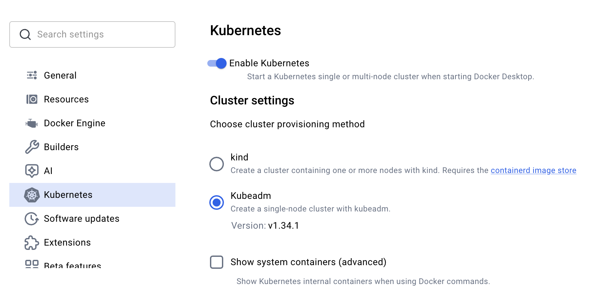
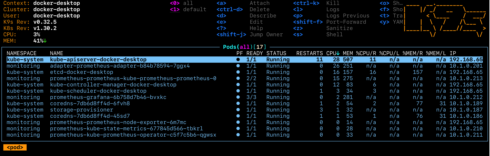

# Kubernetes Training

This set of general Kubernetes training materials was designed to run on the Kubernetes that is part of Docker Desktop on a Mac or Windows machine. It should actually run on *any* Kubernetes - but it hasn't been documented/tested outside of Docker Desktop.

## Prerequisites
1. Download and Install [Docker Desktop](https://www.docker.com/products/docker-desktop/)
1. Open Settings (the gear icon in the upper right) and then enable Kubernetes 
    1. Note that if you ever 'mess up' this cluster you can just click that red Reset Kubernetes Cluster and it'll quickly go back to default settings - it's your 'get out of jail free card'!
1. Install Helm
    1. On Mac you can do this via Homebrew with a `brew install helm`
1. Install [k9s](https://k9scli.io/)
    1. On Mac you can do this via Homebrew with a `brew install derailed/k9s/k9s`
1. Install git (if it's not already)
    1. On Mac it should already be there if you have installed XCode and/or its Command Line Tools (which are a prerequisite for Homebrew)
1. Run `git clone https://github.com/jasonumiker/kubernetes-training.git`
1. Make sure your kubeconfig is pointed at docker-desktop:
    1. Run `echo $KUBECONFIG` - you should see `~/.kube/config`
        1. If you don't then run `export KUBECONFIG=~/.kube/config` which will point you there for the remainder of this Terminal session
    1. Then run `kubectl config get-contexts` and you should see
        ```
        CURRENT   NAME             CLUSTER          AUTHINFO         NAMESPACE
        *         docker-desktop   docker-desktop   docker-desktop   

        ```

TODO: Add Windows instructions

## Pods, Probes, Services, ReplicaSets and Deployments
In this section you'll learn about:
* [Pods](https://kubernetes.io/docs/concepts/workloads/pods/) - including how Kubernetes ensures they are healthy and ready for traffic via [Probes](https://kubernetes.io/docs/tasks/configure-pod-container/configure-liveness-readiness-startup-probes/)
* [Services](https://kubernetes.io/docs/concepts/services-networking/service/) - whihc is how to expose them outside your cluster and load-balance them
* [ReplicaSets](https://kubernetes.io/docs/concepts/workloads/controllers/replicaset/) - which is how to scale them out as many 'replica' Pods as you need as well as scale them back in when you no longer need as many
* [Deployments](https://kubernetes.io/docs/concepts/workloads/controllers/deployment/) - which is how we deploy new version/tags of our apps via a new ReplicaSet alongside the existing one and gradually scale it out and the old version down until you're 100% on the new version

### A Pod
Have a look at the PodSpec at [probetest-app/probe-test-app-pod.yaml](https://github.com/jasonumiker/kubernetes-training/blob/main/probe-test-app/probe-test-app-pod.yaml). You'll see the following:
```
apiVersion: v1 #Everything in K8s has to set an explicit apiVersion
kind: Pod #It is a Pod we're creating
metadata:
  name: probe-test-app #Each object has a name
  labels: #But also usually Labels (key:value like AWS Tags)
    app.kubernetes.io/name: probe-test-app #See below re: the common label(s)
spec:
  containers: #We want one or more containers
  - name: probe-test-app #In this case just the one - probe-test-app
    image: jasonumiker/probe-test-app:v1 #With this image:tag
    ports:
    - containerPort: 8080 #On port 8080
    resources:
      requests:
        cpu: 50m #Which needs at least 5% of one core CPU (50/1000)
        memory: 52Mi #And 52 Megabytes of RAM
```
On the subject of labels, the name can't be used in a Label selector for things like Services (which you'll see next). So, we need a label for it as well. It was common to use the 'app' label but recenlty Kubernetes has formalised these into a series of app.kubernetes.io/ labels as described [here](https://kubernetes.io/docs/concepts/overview/working-with-objects/common-labels/).

And we'll look more closely at the Probes in a moment. And a bit more on CPU/Memory Requests and Limits later on as well.

Let's launch this Pod:
* cd into probe-test-app
* Run `kubectl apply -f probe-test-app-pod.yaml`
* Run `kubectl get pods -o wide` - note that you can't get to the Pod's IP which is an overlay network without going through the Node (a local Linux VM running Docker and Kubernetes) or the K8s API

Kubernetes will let us tunnel right to the Pod IP by forwarding a port on our host machine through to it though:
`kubectl port-forward pod/probe-test-app 8080:8080`

Then open http://localhost:8080 in your browser and you'll see the app served by this Pod.

NOTE: You are tunneling *through* the Kubernetes control plane to the Pod. So even if you can't reach the Pod directly (such as in a production environment where a firewall actively prevents it) if you can reach the K8s control plane, and it allows you to port-forward, then you can reach it that way using its access/connectivity to it.

Once you're done you can ctrl-c out of that port-forward in your terminal.

If you wanted to get an interactive shell within the Pod you can do that via the control plane as well:
* `kubectl exec -it probe-test-app -- /bin/bash` - open an interactive bash shell within the pod probe-test-app
* `whoami` - this container is running as the user python
* `ps aux` - I can only see the processes within the container's Linux Namespace
* `exit` - exit back to our Terminal

### A Service
But normally we don't want to go directly to individual Pods. We want a load balancer - and one that bridges the wider corporate network or Internet and our cluster's network in a controlled way.

Kubernetes has a built-in layer 4 loadbalancer in Services.

Let's have a look at an example of a Service at [probe-test-app/probe-test-app-service.yaml](https://github.com/jasonumiker/kubernetes-training/blob/main/probe-test-app/probe-test-app-service.yaml)
```
apiVersion: v1
kind: Service
metadata:
  name: probe-test-app
spec:
  ports:
  - name: 8000-tcp #We want to take traffic in on 8000
    port: 8000
    protocol: TCP
    targetPort: 8080 #And our target Pod(s) are listening on 8080
  selector:
    app.kubernetes.io/name: probe-test-app #And our target Pods have this label
  type: LoadBalancer #More about the various types below
  ```
There are several types of services:
* ClusterIP - given an IP that is only reachable by Pods within the Cluster
* NodePort - this assigns a port on each and every Node in the cluster that will route through to this Pod (even if it isn't on the Node)
* LoadBalancer - this sets up a LoadBalancer external to Kuberenetes to front this service (e.g. AWS NLB)

In the case of Docker Desktop they've mapped the LoadBalancer Service type to your laptop's localhost for convenience.

Deploy the service by running `kubectl apply -f probe-test-app-service.yaml`

You can see the details by running `kubectl get services -o wide`. You'll see that:
* The probe-test-app service is of a LoadBalancer type 
* With an EXTERNAL-IP (usually the DNS address of the external load balancer you should be able to reach it on) of localhost 
* And that it is actually mapping port 8000 on the LoadBalancer through a random NodePort in the 30000-ish range on its way in.
    * You can just ignore that and use the http://localhost:8000 and ignore that though - thanks Docker Desktop!
* That it is pointing at any Pods (it's Selector) with the label `app.kubernetes.io/name=probe-test-app`

If you run `kubectl get endpoints` you'll see the Pod IP there as the only endpoint of the service (you can see the Pod IP to verify it is what you see with `kubectl get pods -o wide`).

To see that in action we can add a 2nd Pod with that label by running `kubectl apply -f probe-test-app-pod-2.yaml`

If you re-run `kubectl get endpoints` you'll now see the 2nd Pod has been added as an endpoint for the serivce.

And if you go to http://localhost:8000 in your browser and refresh you'll see that the name changes in what Pod that you're served from (that you are balanced between them). Note that the hostname the Pod sees is its Pod name - and I am just having it return that hostname out this web app.

### Probes
You may have noticed in the Pod settings that we've defined both of the types of Probes - readinesss and liveness.

```
    livenessProbe:
      httpGet:
        path: /livez
        port: 8080
      initialDelaySeconds: 0
      periodSeconds: 10
      timeoutSeconds: 1
      successThreshold: 1
      failureThreshold: 3
    readinessProbe:
      httpGet:
        path: /readyz
        port: 8080
      initialDelaySeconds: 0
      periodSeconds: 10
      timeoutSeconds: 1
      successThreshold: 1
      failureThreshold: 3
```

You don't have to put all of those settings but I wanted to put them all explictly on what they default to so that you can see what options are available and what their defaults are. You can learn more about them in the K8s documentation [here](https://kubernetes.io/docs/tasks/configure-pod-container/configure-liveness-readiness-startup-probes/#configure-probes)

In short, the livenessProbe controls whether a Pod should be restarted due to it behind unhealthy (as an attempt to heal it) vs. the readinessProbe which is used to decide whether a Service should send it traffic or not. In AWS these two things are often combined - but seperating them into different endpoints and behaviors can be very useful.

The app that you go to on http://localhost:8000 not only tells you if each of these is healthy but it also lets you toggle them between behind healthy and unhealthy.

If you click the button to toggle the livenessProbe then you'll see the container restart - and this app defaults to it behind Healthy so that will 'heal' it. As you can see in the settings above it does the probe every 10 seconds and in order to be restarted it needs to fail it 3 times - so be unhealthy for 30 seconds all up.

To see this in action click the **Toggle Liveness** button. Then run `kubectl get pods -w` and watch for it to restart (press ctrl-c to stop)

To see the readinessProbe in action click the **Toggle Readiness** button. If you refresh http://localhost:8000 after 30 second you'll see it no longer balances you between the two pods but, instead, is only sending you to the Pod that is still passing its readinessProbe.

Unlike the livenessProbe this won't automatically heal - you can heal it by connecting directly to the Pod and clicking the Toggle button again. As we saw you can do that by running:
* `kubectl get pods` - note which of the two has a 0/1 for READY
* `kubectl port-forward pod/probe-test-app(-2) 8001:8080` - Point the port-forward at the not ready Pod Name so that you can go to port 8081 on your laptop to reach it directly (bypassing the Service that won't send you there any longer)
* Click the **Toggle Readiness** button again to 'heal' the service.
* Press ctrl-c to exit the port-forward
* Refresh http://localhost:8000 and see the traffic start to load balance between the two again

Alternatively you could have deleted the Pod and recreated it to heal it (`kubectl delete pod probe-test-app-2 && kubectl apply -f probe-test-app-pod-2.yaml`) - but, since this Pod isn't managed by a ReplicaSet, you would have had to recreate it yourself. Let's look at how a ReplicaSet can help do that for us next.

### ReplicaSets
First, lets delete our two Pods. Since they are the only two that are running in the default Namespace so far we can run `kubectl delete pods --all` to delete them both.

Now we're going to let a ReplicaSet create them for us. Let's have a look at the ReplicaSet YAML spec at [probe-test-app/probe-test-app-replicaset.yaml](https://github.com/jasonumiker/kubernetes-training/blob/main/probe-test-app/probe-test-app-replicaset.yaml)

```
apiVersion: apps/v1
kind: ReplicaSet
metadata:
  name: probe-test-app #Name of our ReplicaSet
  labels:
    app.kubernetes.io/name: probe-test-app #Label of our ReplicaSet
spec:
  replicas: 3
  selector:
    matchLabels:
      app.kubernetes.io/name: probe-test-app #Label on Pods so it thinks it manages them
  template:
    metadata:
      labels:
        app.kubernetes.io/name: probe-test-app #Label it puts on Pods it creates (should match selector)
    spec:
      containers: #From here on very similar to PodSpec - as it is a template for the Pods it creates
        - name: probe-test-app
          image: jasonumiker/probe-test-app:v1
          ports:
            - containerPort: 8080
          resources:
            requests:
              cpu: 50m
              memory: 52Mi
          livenessProbe:
            httpGet:
              path: /livez
              port: 8080
          readinessProbe:
            httpGet:
              path: /readyz
              port: 8080

```

To see it in action you can run `kubectl apply -f probe-test-app-replicaset.yaml`

You'll now see three Pods running with five random characters appended to each.

You can scale this in to two Pods by running `kubectl scale replicaset probe-test-app --replicas=2`.

And you can add tools to automatically scale it in and out for you, such as the [Horizontal Pod Autoscaler](https://kubernetes.io/docs/tasks/run-application/horizontal-pod-autoscale/) or [KEDA](https://keda.sh/), as well. We'll cover those in later sections.

### Deployments
So ReplicaSets help us out abstracting the management and scaling of Pods a bit. But when we want to deploy a new version we ideally want to manage two ReplicaSets - one with the old version and one with the new one. And, for a big Deployment, to scale the old down and the new up gradually so it doesn't require us to run double the services during the cutover etc.

That is where Deployments come in.

You can remove the ReplicaSet by running `kubectl delete replicaset probe-test-app`. We'll replace it with a Deployment.

If you look at the Deployment YAML spec at [probe-test-app/probe-test-app-deployment.yaml](https://github.com/jasonumiker/kubernetes-training/blob/main/probe-test-app/probe-test-app-deployment.yaml) it is nearly identical to the ReplicaSet one. The difference comes when you update a Deployment vs. a ReplicaSet.

Run `kubectl apply -f probe-test-app-deployment.yaml` to see this in action.

If you run `kubectl get pods` you get the first clue there is a difference - it is't just the random 5 characters appended on the name but another random 9 appended before that one. That is because the Deployment manages ReplicaSets with a random name which manages Pods with a random name. If you run `kubectl get replicasets` you'll see that the 9 digits is indeed the one it appended on the ReplicaSet it created.

Now let's say we wanted to upgrade our app to v2 and see what happens. To do so we'd run: 
* `kubectl set image deployment/probe-test-app probe-test-app=jasonumiker/probe-test-app:v2`
* Then quickly run `kubectl get replicasets -w` - you'll see the new ReplicaSet gradually have its DESIRED increased and the old one have its decreased all the way to zero.
* Once you've seen that ctrl-c out of that
* If you run `kubectl events` you can see the scaling actions the Deployment was taking there

You can customise many aspects of this upgrade behavior (how agressive, fast or automatic it is etc.) as documented [here](https://kubernetes.io/docs/concepts/workloads/controllers/deployment/#strategy)

Finally, let's say this was bad and we want to roll it back. You simply run `kubectl rollout undo deployment/probe-test-app` - which will scale the new version ReplicaSet down and the old version back up (since it is still there at 0). It actually leaves the last 10 versions there by default - though you can customise this with `.spec.revisionHistoryLimit`

## Requests, Limits and Scaling Pods

### First let's install Prometheus for Metrics/Monitoring
In order to automatically scale a workload we'll need some metrics to do it in response to.

The most common tool to do that in the Kubernetes / CNCF ecosystem is Prometheus. And that is often visualised with Grafana.

You can install that on your local Kubernetes cluster by:
1. `cd monitoring`
1. Run `./install-prometheus.sh`

Once that is up and running it will have configured both Prometheus and Grafana with Services of type LoadBalancer - so you can reach them on localhost. Prometheus is at http://localhost:9090 with no login. And Grafana is on http://localhost with the login admin and the password prom-operator.

You can see the all the data sources that Prometheus is scraping for metrics (its Targets) at http://localhost:9090/targets. They should all be healthy. The two main ones that are interesting are for our purposes here are:
* Prometheus Node Exporter which gives it host-level metrics on the Node
* And cAdvisor which gives it container-level metrics (which it is actually scraping through the Node's Kubelet)

NOTE: Unfortunatly, for some reason the Kubernetes in Docker Desktop is missing some usual/expected labels on its cAdvisor container-level metrics - container and image being two main ones. [I believe this is because it is using an uncommon container runtime for K8s (cri-docker)](https://github.com/kubernetes/kubernetes/issues/122182) to allow it to bridge back to Docker's container runtime in Docker Desktop. That means that many of the dashboards that ship built-in with this Grafana, that expect those labels, will appear empty unless we change their queries to omit them. It *does* still have the following labels - and so will still work for our needs here - instance, namespace, node, pod and service.

We've also installed the adapter to let Prometheus serve the Kubernetes Metrics API - that serves `kubectl top` as well as the Horizontal Pod Autoscaler. To see that in action run the following:
* `kubectl top nodes`
* `kubectl top pods` to see the Pods in the default Namespace
* `kubectl top pods -n monitoring` to see the Pods in the monitoring Namespace
* etc.

One other nice thing is that k9s, which is a nice console UI for managing Kubernetes that we installed as a prereq but haven't look at yet, ties into this metrics API data if it is available and shows both Node and Pod CPU and Memory information in its UI. 

Run `k9s` to see that in action. Some useful k9s keyboard shortcuts are:
* 0 - to see Pods in all namespaces instead of just the default one
* Press enter/return on a Pod twice to see its logs
* Then escape key twice to go back to the main page
* In addition to the shortcuts on the top of the page type ? to see more (and the escape key to go back out of that)


### The Horiztonal Pod Autoscaler (HPA)
You tell Kubernetes that you want to autoscale a ReplicaSet or Deployment with a Horizontal Pod Autoscaler manifest. Have a look at the example at [probetest-app/probe-test-app-hpa.yaml](https://github.com/jasonumiker/kubernetes-training/blob/main/probe-test-app/probe-test-app-hpa.yaml)]

```
apiVersion: autoscaling/v2
kind: HorizontalPodAutoscaler
metadata:
  name: probe-test-app
spec:
  minReplicas: 1
  maxReplicas: 5
  metrics:
  - resource:
      name: cpu
      target:
        averageUtilization: 50
        type: Utilization
    type: Resource
  scaleTargetRef:
    apiVersion: apps/v1
    kind: Deployment
    name: probe-test-app
```

In this case we are saying we want to scale out when the average CPU utilisation is greater than 50% and in when it is less than that. There are many options you can choose to scale on instead - the various options you can put in this file is well documented [here](https://kubernetes.io/docs/tasks/run-application/horizontal-pod-autoscale-walkthrough/).

Let's apply that HPA by running `kubectl apply -f probe-test-hpa.yaml`

Now we'll generate a bunch of load against our probe-test-app by running `kubectl apply -f generate-load-replicaset.yaml`

Open a new terminal and run `k9s` and you'll see the CPU go up on the probe-test-app as well as the new Pods start to appear as the HPA scales it out.

After you've let it run for a few minutes you kill the generate-load-apps with `kubectl delete replicaset generate-load-app` to kill the load and see the HPA then scale probe-test-app back in to one Pod. You can keep k9s running to watch it and/or run `kubectl describe hpa probe-test-app` to see its current view of the world as well as its recent history of scaling actions.

Note that there is a "Downscale Stabalization Window" which defaults to 5 minutes - so it is less agressive on scaling back *in* than it was *out* to prevent flapping and given adding Pods is usually less risky than taking them away.

