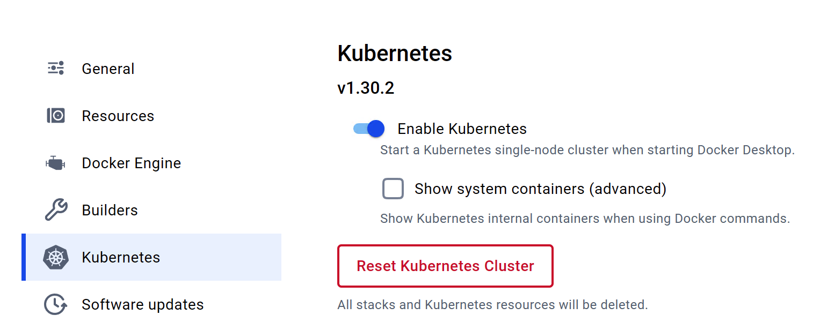

# Kubernetes Training

This set of general Kubernetes training materials was designed to run on the Kubernetes that is part of Docker Desktop on a Mac or Windows machine. It should actually run on *any* Kubernetes - but it hasn't been documented/tested outside of Docker Desktop.

## Prerequisites
1. Download and Install [Docker Desktop](https://www.docker.com/products/docker-desktop/)
1. Open Settings (the gear icon in the upper right) and then enable Kubernetes 
    1. Note that if you ever 'mess up' this cluster you can just click that red Reset Kubernetes Cluster and it'll quickly go back to default settings - it's your 'get out of jail free card'!
1. Install Helm
    1. On Mac you can do this via Homebrew with a `brew install helm`
1. Install [k9s](https://k9scli.io/)
    1. On Mac you can do this via Homebrew with a `brew install derailed/k9s/k9s`
1. Install git (if it's not already)
    1. On Mac it should already be there if you have installed XCode and/or its Command Line Tools (which are a prerequisite for Homebrew)
1. Run `git clone https://github.com/jasonumiker/kubernetes-training.git`
1. Make sure your kubeconfig is pointed at docker-desktop:
    1. Run `echo $KUBECONFIG` - you should see `~/.kube/config`
        1. If you don't then run `export KUBECONFIG=~/.kube/config` which will point you there for the remainder of this Terminal session
    1. Then run `kubectl config get-contexts` and you should see
        ```
        CURRENT   NAME             CLUSTER          AUTHINFO         NAMESPACE
        *         docker-desktop   docker-desktop   docker-desktop   

        ```
    1. And/or run `kubectl get nodes` and you should see
      ```
      NAME             STATUS   ROLES           AGE   VERSION
      docker-desktop   Ready    control-plane   10s   v1.30.2
      ```
    1. If you don't see this then I'd suggest these troubleshooting steps:
      1. Doing a `mv ~/.kube/config ~/.kube/config.old` and then restarting Docker Desktop (for it to create your KUBECONFIG from fresh)
      1. Go to Troubleshooting in Docker Desktop and click the `Clean/Purge Data` button (to fully restore the whole Linux VM to fresh)
      1. Double-check your KUBECONFIG is set to the right/default path by running `echo $KUBECONFIG`

TODO: Add Windows instructions

## Pods, Probes, Services, ReplicaSets, Deployments and StatefulSets
In this section you'll learn about:
* [Pods](https://kubernetes.io/docs/concepts/workloads/pods/) - including how Kubernetes ensures they are healthy and ready for traffic via [Probes](https://kubernetes.io/docs/tasks/configure-pod-container/configure-liveness-readiness-startup-probes/)
* [Services](https://kubernetes.io/docs/concepts/services-networking/service/) - which is how to expose them outside your cluster and load-balance them
* [ReplicaSets](https://kubernetes.io/docs/concepts/workloads/controllers/replicaset/) - which is how to scale them out as many 'replica' Pods as you need as well as scale them back in when you no longer need as many
* [Deployments](https://kubernetes.io/docs/concepts/workloads/controllers/deployment/) - which is how we deploy new version/tags of our apps via a new ReplicaSet alongside the existing one and gradually scale it out and the old version down until you're 100% on the new version
* [StatefulSets](https://kubernetes.io/docs/concepts/workloads/controllers/statefulset/) - which is how we deploy stateful workloads that need consistent naming/DNS and to be reconnected to their [PersistentVolumes](https://kubernetes.io/docs/concepts/storage/persistent-volumes/).
* [DaemonSets](https://kubernetes.io/docs/concepts/workloads/controllers/daemonset/) - which is how we can say we want to deploy something once on every Node in the cluster

### A Pod
Have a look at the PodSpec at [probetest-app/probe-test-app-pod.yaml](https://github.com/jasonumiker/kubernetes-training/blob/main/probe-test-app/probe-test-app-pod.yaml). You'll see the following:
```
apiVersion: v1 #Everything in K8s has to set an explicit apiVersion
kind: Pod #It is a Pod we're creating
metadata:
  name: probe-test-app #Each object has a name
  labels: #But also usually Labels (key:value like AWS Tags)
    app.kubernetes.io/name: probe-test-app #See below re: the common label(s)
spec:
  containers: #We want one or more containers
  - name: probe-test-app #In this case just the one - probe-test-app
    image: jasonumiker/probe-test-app:v1 #With this image:tag
    ports:
    - containerPort: 8080 #On port 8080
    resources:
      requests:
        cpu: 50m #Which needs at least 5% of one core CPU (50/1000)
        memory: 52Mi #And 52 Megabytes of RAM
```
On the subject of labels, the name can't be used in a Label selector for things like Services (which you'll see next). So, we need a label for it as well. It was common to use the 'app' label but recently Kubernetes has formalized these into a series of app.kubernetes.io/ labels as described [here](https://kubernetes.io/docs/concepts/overview/working-with-objects/common-labels/).

And we'll look more closely at the Probes in a moment. And a bit more on CPU/Memory Requests and Limits later on as well.

Let's launch this Pod:
* cd into probe-test-app
* Run `kubectl apply -f probe-test-app-pod.yaml`
* Run `kubectl get pods -o wide` - note that you can't get to the Pod's IP which is an overlay network without going through the Node (a local Linux VM running Docker and Kubernetes) or the K8s API

Kubernetes will let us tunnel right to the Pod IP by forwarding a port on our host machine through to it though:
`kubectl port-forward pod/probe-test-app 8080:8080`

Then open http://localhost:8080 in your browser and you'll see the app served by this Pod.

NOTE: You are tunneling *through* the Kubernetes control plane to the Pod. So even if you can't reach the Pod directly (such as in a production environment where a firewall actively prevents it) if you can reach the K8s control plane, and it allows you to port-forward, then you can reach it that way using its access/connectivity to it.

Once you're done you can ctrl-c out of that port-forward in your terminal.

If you wanted to get an interactive shell within the Pod you can do that via the control plane as well:
* `kubectl exec -it probe-test-app -- /bin/bash` - open an interactive bash shell within the pod probe-test-app
* `whoami` - this container is running as the user python
* `ps aux` - I can only see the processes within the container's Linux Namespace
* `exit` - exit back to our Terminal

### A Service
But normally we don't want to go directly to individual Pods. We want a load balancer - and one that bridges the wider corporate network or Internet and our cluster's network in a controlled way.

Kubernetes has a built-in layer 4 loadbalancer in Services.

Let's have a look at an example of a Service at [probe-test-app/probe-test-app-service.yaml](https://github.com/jasonumiker/kubernetes-training/blob/main/probe-test-app/probe-test-app-service.yaml)
```
apiVersion: v1
kind: Service
metadata:
  name: probe-test-app
spec:
  ports:
  - name: 8000-tcp #We want to take traffic in on 8000
    port: 8000
    protocol: TCP
    targetPort: 8080 #And our target Pod(s) are listening on 8080
  selector:
    app.kubernetes.io/name: probe-test-app #And our target Pods have this label
  type: LoadBalancer #More about the various types below
  ```
There are several types of services:
* ClusterIP - given an IP that is only reachable by Pods within the Cluster
* NodePort - this assigns a port on each and every Node in the cluster that will route through to this Pod (even if it isn't on the Node)
* LoadBalancer - this sets up a LoadBalancer external to Kubernetes to front this service (e.g. AWS NLB)

In the case of Docker Desktop they've mapped the LoadBalancer Service type to your laptop's localhost for convenience.

Deploy the service by running `kubectl apply -f probe-test-app-service.yaml`

You can see the details by running `kubectl get services -o wide`. You'll see that:
* The probe-test-app service is of a LoadBalancer type 
* With an EXTERNAL-IP (usually the DNS address of the external load balancer you should be able to reach it on) of localhost 
* And that it is actually mapping port 8000 on the LoadBalancer through a random NodePort in the 30000-ish range on its way in.
    * You can just ignore that and use the http://localhost:8000 and ignore that though - thanks Docker Desktop!
* That it is pointing at any Pods (it's Selector) with the label `app.kubernetes.io/name=probe-test-app`

If you run `kubectl get endpoints` you'll see the Pod IP there as the only endpoint of the service (you can see the Pod IP to verify it is what you see with `kubectl get pods -o wide`).

To see that in action we can add a 2nd Pod with that label by running `kubectl apply -f probe-test-app-pod-2.yaml`

If you re-run `kubectl get endpoints` you'll now see the 2nd Pod has been added as an endpoint for the service.

And if you go to http://localhost:8000 in your browser and refresh you'll see that the name changes in what Pod that you're served from (that you are balanced between them). Note that the hostname the Pod sees is its Pod name - and I am just having it return that hostname out this web app.

One last thing to note about Services is that Kubernetes creates a DNS record for them in a naming convention that allows for easy and predictable discovery of them by other Pods running within the same cluster. The naming convention is `service-name.namespace-name.svc.cluster.local`. You'll see this convention used later on in the init containers example below. Note that this only applies within a Pod - you can't use this convention outside the cluster or between clusters.

### Probes
You may have noticed in the Pod settings that we've defined both of the types of Probes - readiness and liveness.

```
    livenessProbe:
      httpGet:
        path: /livez
        port: 8080
      initialDelaySeconds: 0
      periodSeconds: 10
      timeoutSeconds: 1
      successThreshold: 1
      failureThreshold: 3
    readinessProbe:
      httpGet:
        path: /readyz
        port: 8080
      initialDelaySeconds: 0
      periodSeconds: 10
      timeoutSeconds: 1
      successThreshold: 1
      failureThreshold: 3
```

You don't have to put all of those settings but I wanted to put them all explicitly on what they default to so that you can see what options are available and what their defaults are. You can learn more about them in the K8s documentation [here](https://kubernetes.io/docs/tasks/configure-pod-container/configure-liveness-readiness-startup-probes/#configure-probes)

In short, the livenessProbe controls whether a Pod should be restarted due to it being unhealthy (as an attempt to heal it) vs. the readinessProbe which is used to decide whether a Service should send it traffic or not. In AWS these two things are often combined - but separating them into different endpoints and behaviors can be very useful.

The app that you go to on http://localhost:8000 not only tells you if each of these is healthy but it also lets you toggle them between behind healthy and unhealthy.

If you click the button to toggle the livenessProbe then you'll see the container restart - and this app defaults to it behind Healthy so that will 'heal' it. As you can see in the settings above it does the probe every 10 seconds and in order to be restarted it needs to fail it 3 times - so be unhealthy for 30 seconds all up.

To see this in action click the **Toggle Liveness** button. Then run `kubectl get pods -w` and watch for it to restart (press ctrl-c to stop)

To see the readinessProbe in action click the **Toggle Readiness** button. If you refresh http://localhost:8000 after 30 second you'll see it no longer balances you between the two pods but, instead, is only sending you to the Pod that is still passing its readinessProbe.

Unlike the livenessProbe this won't automatically heal - you can heal it by connecting directly to the Pod and clicking the Toggle button again. As we saw you can do that by running:
* `kubectl get pods` - note which of the two has a 0/1 for READY
* `kubectl port-forward pod/probe-test-app(-2) 8001:8080` - Point the port-forward at the not ready Pod Name so that you can go to port 8081 on your laptop to reach it directly (bypassing the Service that won't send you there any longer)
* Click the **Toggle Readiness** button again to 'heal' the service.
* Press ctrl-c to exit the port-forward
* Refresh http://localhost:8000 and see the traffic start to load balance between the two again

Alternatively you could have deleted the Pod and recreated it to heal it (`kubectl delete pod probe-test-app-2 && kubectl apply -f probe-test-app-pod-2.yaml`) - but, since this Pod isn't managed by a ReplicaSet, you would have had to recreate it yourself. Let's look at how a ReplicaSet can help do that for us next.

### ReplicaSets
First, lets delete our two Pods. Since they are the only two that are running in the default Namespace so far we can run `kubectl delete pods --all` to delete them both.

Now we're going to let a ReplicaSet create them for us. Let's have a look at the ReplicaSet YAML spec at [probe-test-app/probe-test-app-replicaset.yaml](https://github.com/jasonumiker/kubernetes-training/blob/main/probe-test-app/probe-test-app-replicaset.yaml)

```
apiVersion: apps/v1
kind: ReplicaSet
metadata:
  name: probe-test-app #Name of our ReplicaSet
  labels:
    app.kubernetes.io/name: probe-test-app #Label of our ReplicaSet
spec:
  replicas: 3
  selector:
    matchLabels:
      app.kubernetes.io/name: probe-test-app #Label on Pods so it thinks it manages them
  template:
    metadata:
      labels:
        app.kubernetes.io/name: probe-test-app #Label it puts on Pods it creates (should match selector)
    spec:
      containers: #From here on very similar to PodSpec - as it is a template for the Pods it creates
        - name: probe-test-app
          image: jasonumiker/probe-test-app:v1
          ports:
            - containerPort: 8080
          resources:
            requests:
              cpu: 50m
              memory: 52Mi
          livenessProbe:
            httpGet:
              path: /livez
              port: 8080
          readinessProbe:
            httpGet:
              path: /readyz
              port: 8080

```

To see it in action you can run `kubectl apply -f probe-test-app-replicaset.yaml`

You'll now see three Pods running with five random characters appended to each.

You can scale this in to two Pods by running `kubectl scale replicaset probe-test-app --replicas=2`.

And you can add tools to automatically scale it in and out for you, such as the [Horizontal Pod Autoscaler](https://kubernetes.io/docs/tasks/run-application/horizontal-pod-autoscale/) or [KEDA](https://keda.sh/), as well. We'll cover those in later sections.

### Deployments
So ReplicaSets help us out abstracting the management and scaling of Pods a bit. But when we want to deploy a new version we ideally want to manage two ReplicaSets - one with the old version and one with the new one. And, for a big Deployment, to scale the old down and the new up gradually so it doesn't require us to run double the services during the cutover etc.

That is where Deployments come in.

You can remove the ReplicaSet by running `kubectl delete replicaset probe-test-app`. We'll replace it with a Deployment.

If you look at the Deployment YAML spec at [probe-test-app/probe-test-app-deployment.yaml](https://github.com/jasonumiker/kubernetes-training/blob/main/probe-test-app/probe-test-app-deployment.yaml) it is nearly identical to the ReplicaSet one. The difference comes when you update a Deployment vs. a ReplicaSet.

Run `kubectl apply -f probe-test-app-deployment.yaml` to see this in action.

If you run `kubectl get pods` you get the first clue there is a difference - it is't just the random 5 characters appended on the name but another random 9 appended before that one. That is because the Deployment manages ReplicaSets with a random name which manages Pods with a random name. If you run `kubectl get replicasets` you'll see that the 9 digits is indeed the one it appended on the ReplicaSet it created.

Now let's say we wanted to upgrade our app to v2 and see what happens. To do so we'd run: 
* `kubectl set image deployment/probe-test-app probe-test-app=jasonumiker/probe-test-app:v2`
* Then quickly run `kubectl get replicasets -w` - you'll see the new ReplicaSet gradually have its DESIRED increased and the old one have its decreased all the way to zero.
* Once you've seen that ctrl-c out of that
* If you run `kubectl events` you can see the scaling actions the Deployment was taking there

You can customize many aspects of this upgrade behavior (how aggressive, fast or automatic it is etc.) as documented [here](https://kubernetes.io/docs/concepts/workloads/controllers/deployment/#strategy)

Finally, let's say this was bad and we want to roll it back. You simply run `kubectl rollout undo deployment/probe-test-app` - which will scale the new version ReplicaSet down and the old version back up (since it is still there at 0). It actually leaves the last 10 versions there by default - though you can customize this with `.spec.revisionHistoryLimit`

### Quarantine a Pod by removing the label from it that the operators are selecting it on?
One interesting common thread with Services and ReplicaSets have in common is that they are looking for Pods with certain label(s).

If you take a pod and remove the label that they are looking for (which is often the same for both) then it will stop getting Service traffic and/or it won't be killed by the ReplicaSet (which feels that it is no longer managing it). The ReplicaSet will add another one to 'replace' it since it doesn't see it any longer as well.

To see this in action:
* Run `kubectl get pods` and copy the name of one of the probe-test-app Pods
  * If there aren't any running do a `kubectl apply -f probe-test-app-deployment.yaml` and a `kubectl apply -f probe-test-app-service.yaml` to ensure both are running
* Run `kubectl label pod [copied pod name] app.kubernetes.io/name-` as if you put a minus sign after the label it in a `kubectl label` command it removes it
* Run `kubectl get pods` and note that the ReplicaSet launched another one because it doesn't include the one that we re-labeled in its list anymore. 
  * Since this is the same label we used for the Service it also would have stopped getting traffic from that at the same time too...
* Run `kubectl describe replicaset probe-test-app` and see the details of its action from its perspective there too

### Sidecar and Init containers within a Pod
A Pod is made up of one or more containers. The containers section is a sequence/array and you can just specify more of them. When you specify more than one container in the Pod, the additional ones are called [Sidecar Containers](https://kubernetes.io/docs/concepts/workloads/pods/sidecar-containers/).

These containers are:
* Scheduled together on the same Node
  * So, they always scale in/out together in ReplicaSets etc.
* Put in the same Linux Namespace / Security Boundary so that:
  * They be configured to see each other's processes - see [here](https://kubernetes.io/docs/tasks/configure-pod-container/share-process-namespace/)
  * They share the same network interface and IP address
    * This means they can run their services on different ports on their shared network interface/IP and reach each other on localhost on their respective ports
  * They share the same storage Namespace and can share [emptyDir Volumes](https://kubernetes.io/docs/concepts/storage/volumes/#emptydir) between each other (these exist just to have an ephemeral Volume to share some data between containers in the same Pod)

And there is also a special type of additional container called [Init Containers](https://kubernetes.io/docs/concepts/workloads/pods/init-containers/) that run before the other container(s) in the Pod and can contain utilities or setup scripts not present in an app image (e.g. to load the schema into an empty database that the app expects to be there etc.). These:
 * Always run to completion (rather than stay running all the time like the main or sidecar containers)
 * Each init container in the YAML sequence/array must complete successfully before the next one starts (so you can count on that ordering)

First, we have a sidecar container example. In this example there is an 'app' container which is generating a log file. That is being written to a shared emptyDir Volume that is also mounted in our 'sidecar' container. That, in turn, is running nginx to share the contents of this log file out on port 80. This is meant to represent a logging sidecar that maybe would send the logs on to Splunk etc. instead. To see this in action:
* `cd ../sidecar-and-init-containers`
* `kubectl apply -f sidecar.yaml`
* `kubectl exec pod-with-sidecar -c sidecar-container -it bash` - connect to the sidecar container within the Pod
* `apt-get update && apt-get install curl` - install curl within that sidecar
* `curl 'http://localhost:80/app.txt'` - access the log file via the sidecar's nginx service
* `exit` to exit out of our interactive kubectl exec session

Next, we have an init container example. In this example we will only start our main application once two Kubernetes Services exist. We have two different initContainers which check for each of these two services.
* `kubectl apply -f init.yaml`
* `kubectl get pod myapp-pod` - you'll see it is waiting on the first init container to be successful
* `kubectl apply -f services-init-requires.yaml` - create those services it is looking for
* `kubectl get pod myapp-pod -w` - quickly do a kubectl get with a -w to watch/follow the output
* Once you see the initContainers succeed and the Pod go to Running you can ctrl-c to exit the -w

### PersistentVolumes, PersistentVolumeClaims and StorageClasses
Deployments are great for stateless workloads - but some workload on Kubernetes require state. The way that Kubernetes does this is that it allows Pods to ask for PersistentVolumes - which usually map through to things like EBS Volumes in AWS or Persistent Disks in GCP etc.

Kubernetes hands the creation, updating and deletion of these volumes out on the cloud or in your SAN to a Container Storage Interface (CSI) driver. Appropriate CSI drivers will usually be installed by the cloud provider or internal platform team for the cluster that you're running as part of creating and bootstrapping your cluster.

For the purposes of this environment we have a sort of 'dummy' CSI driver called hostpath-provisioner. The "volumes" it creates are just folders on the Node that it is running on (making them persist across Pod restarts but not against the termination of the Node and its local disk). 

First install that by:
* `cd pvs-and-statefulsets`
* `kubectl apply -f hostpath-provisioner.yaml`
* `kubectl get storageclass` - you'll see our new 'mock' CSI driver listed there now as hostpath-provisioner

Pods ask for PersistentVolumes via PersistentVolumeClaims. The CSI driver takes those claims and goes and provisions a PersistentVolume for that Pod. Those PersistentVolumes can, in turn, be mounted into Pod(s).

First, have a look at pvc.yaml and pod.yaml in pvs-and-statefulsets/

Then see this in action by:
* `kubectl apply -f pvc.yaml`
* `kubectl get pvc` - note it is there as Pending because no Pod has used it yet
* `kubectl apply -f pod.yaml`
* `kubectl get pvc` - see now that it is Bound and there a VOLUME listed
* `kubectl get pv` - here you'll see the PersistentVolume that was created by fulfilling the claim
* http://localhost:8001 - we mounted an empty volume at the nginx path
* `kubectl exec -it nginx  -- bash -c "echo 'Data on PV' > /usr/share/nginx/html/index.html"` to write some stuff to index.html for nginx to display
* http://localhost:8001
* `kubectl delete pod nginx`
* `kubectl get pv` - even if we delete the Pod the volume is still here
* `kubectl apply -f pod.yaml` - and if we re-create the Pod it just mounts it back
* `kubectl get pv` - note it is the same PersistentVolume (not a new one)
* http://localhost:8001 - note we can still see the data in it too
* `kubectl delete service nginx`, `kubectl delete pod nginx` and `kubectl delete pvc test-pvc` - clean up our example
* `kubectl get pv` - Deleting our PersistentVolumeClaim deleted our PV

### StatefulSets
Deployments are good for stateless applications that need to scale in and out with load - but they are not really appropriate for stateful ones. That is where StatefulSets come in.

These do a few things:
* The keep consistent Pod names (kill the Pod and it'll get the same name back) - which in K8s also means the same DNS-resolvable service-discovery as well. And it uses a nice naming convention for them.
  * These pod names go [podname]-0, [podname]-1 etc. as you scale it out
    * The application needs to cluster and replicate between these Pods for a scale out to be effective - K8s can't do that bit for the app
  * It scales out by launching another pod with ascending numbers and down by removing the pod with the largest number
* The Pods keep the same PersistentVolumes associated with them when they come back
  * If you scale up from 1 to 2 then pod-1 will appear and get its own Volume. Then if you scale back down to 1 pod-1 wil go away but the Volume will stay there ready to be remounted. And then if you scale back to 2 it'll have the same volume with all the same data in it.
  * It also works if you kill a Pod it'll get it's particular volume back when it is relaunched - including on another Node when it is running in AWS/GCP or even in a place with a real Storage Area Network (SAN)-backed PersistentVolume.

There is a good example of a StatefulSet in the RabbitMQ that we'll also need for the KEDA example below. Let's deploy that now just to have a look at how the StatefulSet and PVs work before we get to KEDA:
* `cd keda-example/rabbitmq`
* `kubectl apply -k .` - This deploys everything in the kustomization.yaml file in the order it is listed there (due to the -k) - we'll cover more about Kustomize in a later section
* `kubectl describe statefulset rabbitmq` to see more about our new StatefulSet
* `kubectl get pods` - you'll see a rabbitmq-0 - unlike ReplicaSets which appends some random characters to the end of the Pod name
* `kubectl get pvc` and `kubectl get pv` - you'll see that it got its own PersistentVolume via its own PersistentVolumeClaim
* `kubectl delete pod rabbit-mq-0` and `kubectl get pods` - you'll see that the Pod comes back with the same name and the same PersistentVolume with its state in it

We'll look more closely at this RabbitMQ in the KEDA section later on...

### DaemonSets
DaemonSets are a way to tell Kubernetes that you want to run a Pod on every Node. This is useful for Kubernetes components and host agents that facilitate networking, storage, security and observability in the cluster.

We do have one installed in our cluster as part of the monitoring tooling - the prometheus-node-exporter. It collects host/Node-level metrics which is then scraped by Prometheus to get them into that where we can also visualise them with Grafana.

You can run `kubectl get daemonset prometheus-prometheus-node-exporter -n monitoring -o yaml` to see the manifest for it. As you'll see it is quite similar to the other controllers like ReplicaSet or Deployment in that you're giving it an embedded PodSpec with some additional parameters about how you want to run it across all the Nodes.

Note also that, as you see in this example, with a `get` with a `-o yaml` you can basically export the YAML manifests out of any running object and do a `> output.yaml` at the end to save it. You can then re-import that back into the cluster with a `kubectl apply -f` if you need to.

## Requests, Limits and Scaling Pods
In this section you'll learn about:
* Using [Prometheus](https://prometheus.io/) for Metrics/Monitoring (as we require metrics to inform automatic scaling - but they also are necessary to operate your cluster and apps too...)
  * Prometheus is also a CNCF project like Kubernetes (in the same "Cloud Native ecosystem") - so while it isn't the only way to monitor it they often go together
* The built-in [Horizontal Pod Autoscaler (HPA)](https://kubernetes.io/docs/tasks/run-application/horizontal-pod-autoscale/) that will scale your Pods in/out based on metrics.
* Pod CPU and Memory Requests and Limits - as scaling your Pods is quite linked with their sizing (the CPU and Memory they require)
* [Kubernetes Event-driven Autoscaling (KEDA)](https://keda.sh/) - for when you want to scale your Pods based on something like queue-length rather than load

### First let's install Prometheus for Metrics/Monitoring
In order to automatically scale a workload we'll need some metrics to do that in response to.

The most common tool to do that in the Kubernetes / CNCF ecosystem is Prometheus. And that is often visualized with Grafana.

You can install that on your local Kubernetes cluster by:
1. `cd monitoring`
1. Run `./install-prometheus.sh`

Once that is up and running it will have configured both Prometheus and Grafana with Services of type LoadBalancer - so you can reach them on localhost. Prometheus is at http://localhost:9090 with no login. And Grafana is on http://localhost:3000 with the login admin and the password prom-operator.

You can see the all the data sources that Prometheus is scraping for metrics (its Targets) at http://localhost:9090/targets. They should all be healthy. The two main ones that are interesting are for our purposes here are:
* Prometheus Node Exporter which gives it host-level metrics on the Node
* And cAdvisor which gives it container-level metrics (which it is actually scraping through the Node's Kubelet)

NOTE: Unfortunately, for some reason the Kubernetes in Docker Desktop is missing some usual/expected labels on its cAdvisor container-level metrics - container and image being two main ones. [I believe this is because it is using an uncommon container runtime for K8s (cri-docker)](https://github.com/kubernetes/kubernetes/issues/122182) to allow it to bridge back to Docker's container runtime in Docker Desktop. That means that many of the dashboards that ship built-in with this Grafana, that expect those labels, will appear empty unless we change their queries to omit them. It *does* still have the following labels - and so will still work for our needs here - instance, namespace, node, pod and service.

We've also installed the adapter to let Prometheus serve the Kubernetes Metrics API - that serves `kubectl top` as well as the Horizontal Pod Autoscaler. To see that in action run the following:
* `kubectl top nodes`
* `kubectl top pods` to see the Pods in the default Namespace
* `kubectl top pods -n monitoring` to see the Pods in the monitoring Namespace
* etc.

One other nice thing is that k9s, which is a nice console UI for managing Kubernetes that we installed as a pre-req but haven't look at yet, ties into this metrics API data if it is available and shows both Node and Pod CPU and Memory information in its UI. 

Run `k9s` to see that in action. Some useful k9s keyboard shortcuts are:
* 0 - to see Pods in all namespaces instead of just the default one
* Press enter/return on a Pod twice to see its logs
* Then escape key twice to go back to the main page
* In addition to the shortcuts on the top of the page type ? to see more (and the escape key to go back out of that)


### The Horizontal Pod Autoscaler (HPA)
You tell Kubernetes that you want to auto-scale a ReplicaSet or Deployment with a Horizontal Pod Autoscaler manifest - which includes what metrics and when/how to do that. Have a look at the example at [probetest-app/probe-test-app-hpa.yaml](https://github.com/jasonumiker/kubernetes-training/blob/main/probe-test-app/probe-test-app-hpa.yaml)]


```
apiVersion: autoscaling/v2
kind: HorizontalPodAutoscaler
metadata:
  name: probe-test-app
spec:
  minReplicas: 1
  maxReplicas: 5
  metrics:
  - resource:
      name: cpu
      target:
        averageUtilization: 50
        type: Utilization
    type: Resource
  scaleTargetRef:
    apiVersion: apps/v1
    kind: Deployment
    name: probe-test-app
```

In this case we are saying we want to scale out when the average CPU utilization is greater than 50% and in when it is less than that. There are many options you can choose to scale on instead - the various options you can put in this file is well documented [here](https://kubernetes.io/docs/tasks/run-application/horizontal-pod-autoscale-walkthrough/).

Let's apply that HPA by running `kubectl apply -f probe-test-hpa.yaml`

Now we'll generate a bunch of load against our probe-test-app by running `kubectl apply -f generate-load-replicaset.yaml`

Open a new terminal and run `k9s` and you'll see the CPU go up on the probe-test-app as well as the new Pods start to appear as the HPA scales it out.

After you've let it run for a few minutes you kill the generate-load-apps with `kubectl delete replicaset generate-load-app` to kill the load and see the HPA then scale probe-test-app back in to one Pod. You can keep k9s running to watch it and/or run `kubectl describe hpa probe-test-app` to see its current view of the world as well as its recent history of scaling actions.

Note that there is a "Downscale Stabilization Window" which defaults to 5 minutes - so it is less aggressive on scaling back *in* than it was *out* to prevent flapping and given adding Pods is usually less risky than taking them away.

### CPU and Memory Requests
A request is telling Kubernetes that your Pod needs at least that much CPU time and Memory. It won't constrain it unless it needs to in order to fulfil the requests of other Pods - that is what Limits are for which we'll look at next.

Putting appropriate CPU and Memory Requests on your workloads is important for two reasons:
* The Kubernetes Scheduler will only put it on a Node where it 'fits' based on its Requests (it has that much CPU and Memory that hasn't hasn't been requested by other Pods it has scheduled there)
  * If there isn't enough free space on any Node it'll mark the Pod as Unschedulable. This is where the [Cluster Autoscaler](https://github.com/kubernetes/autoscaler/tree/master/cluster-autoscaler) or [Karpenter](https://karpenter.sh/) come in to add more Nodes so they can be scheduled. We can't really simulate that in our single-node Docker Desktop so will leave that for a future training session that is in cloud.
* The Kubelet configures the local Linux kernel control groups (cgroups) to ensure that Pod gets at least the CPU and Memory that it requested.

### CPU and Memory Limits - and how misconfiguring them can really hurt your performance and availability
There is also the option of putting a CPU and Memory Limit on your Pods. These can prove to be much more disruptive to your performance and availability if you get them wrong.

In the case of CPU this is "compressible" and so K8s CPU Limits will just make your Pod wait (called throttling) rather than scheduling you on the CPU - even if it is available - once you hit it. Memory, on the other hand, isn't compressible - and so if your pod tries to exceed a Memory limit that is set on it then it'll be killed (called OOMKilled for Out-of-Memory Killed). 

While it is clear that your Pod getting killed is disruptive, as you'll see in this example CPU throttling can really impair your workload as well.

The way that K8s CPU Limits are implemented within Linux cgroups is that you are specifying how much of CPU time that you want to limit the Pod to within each of its 100ms accounting/evaluation period. You often see Kubernetes CPU limits written in units of 1000m (with m being a thousandth of a CPU core) - so 2000m would be two full cores while 50m would be 5% of a CPU core. You can also use whole core numbers such a 2 for two cores or 0.1 for 10% of a core as  well.

The issue is if you have a busy multi-threaded app running across many Cores at once you can use all of your limit quite quickly. Say that, for example, you have a CPU limit of 1000m but you have a busy app running 10 threads in your Pod. You can use all of your allocated CPU time in 10ms (10ms * 10 cores is the same as 100ms * 1 core in its view) - and then you'll be throttled for 90ms or 90% of the time! And this would happen over and over for each 100ms accounting.


It isn't just CPU Limits that can throttle your Pod(s) - the Linux cgroups as configured will also throttle you if they need to in order to satisfy the CPU Reservations of other Pods (i.e. if needed to give them the amount of CPU they have 'reserved' if you have exhausted your reservation).

Let's see this in action:
* `cd limit-examples`
* `kubectl apply -f cpu-stressor.yaml` - this will kick off an app that is trying to use 2 full CPUs (i.e. 2 fully utilized threads) but with a CPU limit of 1 CPU
  * This means we should get 50ms of CPU and then get throttled for 50ms each accounting period of 100ms
* Open Prometheus by going to http://localhost:9090
* Paste in the following query `container_cpu_cfs_throttled_seconds_total` and press Execute.
  * Go to the Graph tab - if you hover over the line you'll see it is your cpu-stressor Pod
  * This query is showing the total amount of time the Pod has been throttled and so will only go up over time. You can choose to use rate() to work out per-second average rate (e.g. `rate(container_cpu_cfs_throttled_seconds_total[5m])` will tell you the per-second rate over the last 5 minutes)
* `kubectl edit deployment cpu-stressor` and edit the CPU Limit to 2
  * This is likely with vi so you type `i` to Insert and then hit Esc and :wq to finish
  * You can't change this for a running Pod so you'll see the Deployment create a new one with the new Limit and kill the old one
  * This should make that metric go down - but it likely won't be zero since this cpu-stressor isn't *exact* and there might be some throttling around ensuring the Reservations of other Pods are met depending on how many cores on your laptop you gave Docker Desktop etc.
* `kubectl delete pod cpu-stressor` - clean this up when done

You can read more about this on [this great AWS Blog Post](https://aws.amazon.com/blogs/containers/using-prometheus-to-avoid-disasters-with-kubernetes-cpu-limits/).

The best way to 'fix' this for an app is to control how many threads it uses and align that with the Reservation and Limit you are setting. Many languages and runtimes are now "container friendly" and will work out the cgroup they are in and align their thread counts to that automatically. But many don't and you'll need to specify a parameter around thread count at runtime.

A controversial opinion here is that, as long as you ensure that everything has an adequate CPU Reservation set, that CPU Limits often do more harm than good and you should avoid them. If you don't set Limits then it will allow Pods to burst into additional CPU that isn't being used if it is available and still wouldn't hurt other apps getting what they Reserved.

That was CPU Limits - now let's see a Memory Limit OOMKill:
* `kubectl apply -f memory-stressor.yaml` - this deploys a workload that has a limit of 100Mi and tries to consume 150Mi of memory
* `kubectl get pods -w` - you'll see it alternate between STATUS OOMKilled and CrashLoopBackOff (ctrl-c to exit)
* `kubectl delete pod memory-stressor` - clean this up

### Kubernetes Event-driven Autoscaling (KEDA)
HPA is usually sufficient if you are scaling a stateless web service in/out based on CPU utilization or load balancer latency/errors etc. But if you instead want to scale based on the amount of work in a queue or other more event-based concerns that is where the Kubernetes Event-driven Autoscaler (KEDA) comes in.

Under the hood KEDA is actually managing HPA for you to offer even more advanced scaling - similar to the way that a Deployment manages ReplicaSets to do more advanced things around deployments.


KEDA looks at a large number of plugins [(71 as of the time I wrote this)](https://keda.sh/docs/2.16/scalers/) for various queueing and streaming services.

The example we'll use here is one based on a RabbitMQ message queue and wanting to scale out Pods to "do the work" when there is a sudden influx of work into the queue.

You should have already installed RabbitMQ above in the StatefulSet section. If not please run `kubectl apply -k keda-example/rabbitmq`

**NOTE:** We deployed the RabbitMQ container a bit 'manually' here via a StatefulSet to show you how those work. You wouldn't usually do this for stateful popular databases/caches/queues etc. - instead you would use their Operator (and they will almost always have one). In the case of RabbitMQ their operator is documented [here](https://www.rabbitmq.com/kubernetes/operator/operator-overview).

The next step is installing KEDA via its Helm Chart. To do that:
* `cd keda-example`
* `./install-keda.sh` - we'll cover Helm in more detail in a later section

Now that we have KEDA installed our goal is to:
* Implement a service that does work when it is in the RabbitMQ queue (that we want to scale based on the queue length)
* Set up KEDA to scale that service based on the queue length
* And then put a bunch of work to be done in the queue (in order to see it do the scaling as we requested)

The main logic for this is in [keda-example/keda-scaled-object.yaml](https://github.com/jasonumiker/kubernetes-training/blob/main/keda-example/keda-scaled-object.yaml):
```
apiVersion: keda.sh/v1alpha1
kind: ScaledObject
metadata:
  name: rabbitmq-consumer
spec:
  scaleTargetRef:
    name: rabbitmq-consumer
  pollingInterval: 5 # Optional. Default: 30 seconds
  cooldownPeriod: 30 # Optional. Default: 300 seconds
  maxReplicaCount: 30 # Optional. Default: 100
  triggers:
    - type: rabbitmq
      metadata:
        queueName: hello
        queueLength: "5"
```

The settings are to scale to a minimum of 0 replicas (when there is no work in the queue) and up to a maximum of 30 replicas - optimizing for a queue length of 5 messages per replica.

Let's see it in action:
* `kubectl apply -f consumer.yaml` - deploying our RabbitMQ consumer service. This is set to consume one message per instance, sleep for 1 second, and then acknowledge completion of the message. This is used to simulate work.
* `kubectl apply -f keda-scaled-object.yaml` - this configures KEDA on when to scale our new consumer as described above
  * KEDA will scale out the consumer pods until the queue is drained after about 2 minutes at the maximum of 30 concurrent Pods
* `kubectl apply -f publisher.yaml` - run a Kubernetes Job (we'll discuss Jobs in the next section) that will publish 300 messages to the queue that the consumer is listening to.
* `kubectl get pods` or `k9s` and you can watch the consumer pods scale out and then back in again
* `kubectl events` and you can follow the Kubernetes events around the KEDA and the ReplicaSet and Pods that underpin it as they scaled out and back in

You can also follow the progress of the consumers emptying the queue by going to http://localhost:15672/#/queues/%2F/hello and login with admin/admin

If you want to run it again run `kubectl replace -f ./publisher.yaml --force` (the --force is required because there is an existing Job with the same name to replace).

## Jobs and CronJobs
We just used a Job in the KEDA example. A Job in Kubernetes starts a container to runs a task (like a cron job or a batch process) and then stops when it is done. It can be either 'Complete' or 'Failed' based on the return code of the command that gets run in the container.

Have a look at [keda-example/publisher.yaml](https://github.com/jasonumiker/kubernetes-training/blob/main/keda-example/publisher.yaml) as well as `kubectl describe job rabbitmq-publish` to see the details of that Job we just ran. This was a very simple Job that was just running a single container to run a single command only once.

There are many other options documented [here](https://kubernetes.io/docs/concepts/workloads/controllers/job/). These include:
* How many Pods the Job should run in parallel
  * And whether to use a fixed completion count or expect the Jobs to work out among themselves based on an external queue (like the RabbitMQ we just used) instead
* How many times to retry on failure (the `backoffLimit`)
* Etc.

While kicking off a Job right when you want it to run can be useful, you usually will want to schedule them to run at a specific time in the future or on a schedule - that is where Kubernetes' built-in [CronJob controller](https://kubernetes.io/docs/concepts/workloads/controllers/cron-jobs/) comes in.

As you can assume from the name, this lets you run a Job in the future as well as regularly on a schedule like cron.

There is an example cronjob at [cronjob/cronjob.yaml](https://github.com/jasonumiker/kubernetes-training/blob/main/cronjob/cronjob.yaml) that will run once a minute and output the current time as well as a hello message and stop.

Run `kubectl apply -f cronjob.yaml` and then `k9s` and wait to see a Job Pod launch once a minute. You can hit Enter/Return twice to see the logs of that container. If this was a 'real' Job there would be log lines of the work it did and/or they would have put that work into a stateful service like a bucket or database etc.

There is a more elaborate controller for Jobs than CronJobs from Argo called [Argo Workflows](https://argoproj.github.io/workflows/). This lets you specify a series of steps or a directed-asyclic graph (DAG) of work to be done where the output of one Job gets passed to another etc.

The use of Argo Workflows is an advanced enough topic it likely should be its own separate training.

## Kubernetes Namespaces and API Authorization (via Roles/ClusterRoles)
Regardless of how you have people authenticate/login to Kubernetes (AWS IAM Users/Roles for EKS, Google Account to GKE, OIDC to your own identity provider, etc.) Kubernetes does its own authorization. It does this via its [Role Based Access Control (RBAC)](https://kubernetes.io/docs/reference/access-authn-authz/rbac/) APIs.

At a high level, the way Kubernetes RBAC works is that you either assign your Users a [ClusterRole](https://kubernetes.io/docs/reference/access-authn-authz/rbac/#role-and-clusterrole), which gives them cluster-wide privileges, or you assign them a [Role](https://kubernetes.io/docs/reference/access-authn-authz/rbac/#role-and-clusterrole) which restricts them to only have access to a particular Namespace within the cluster. A [Namespace](https://kubernetes.io/docs/concepts/overview/working-with-objects/namespaces/) is a logical boundary and grouping within Kubernetes to isolate the resources of particular teams from one another - so if you put different teams in different Namespaces via Roles the idea is that they can safely share the cluster as they shouldn't be able to interfere with one another. This is known as multi-tenancy. There is a bit more to it than that - we'll talk about other considerations such as Pod security in a later section.

For both a Role as well as a ClusterRole you also assign what rules/permissions to it for what it can do. These are additive - in that there are no denys only allows.

Let's explore how this all works:
1. `kubectl get pods -A` - We are currently signed in as the cluster-admin ClusterRole - we can do anything cluster-wide (e.g. see Pods in all Namespaces)
1. `kubectl api-resources` this shows all the different resources that we can control the use of in our RBAC. 
    1. It also shows which of them are Namespaced (can be managed by Roles) vs. which can't (and are therefore cluster-wide and need a ClusterRole to manage them)
    1. And it also shows the short names for each resource type (which you can use to save typing in kubectl)
1. `kubectl get clusterrole admin -o yaml | less` (press space to page down and q to exit) - This built-in admin role can explicitly do everything - and so you can clone it and remove those things you don't want a user to be able to do. As you can see, the minute you don't do *'s there is quite a lot of YAML here to go through!
1. `kubectl get clusterrole admin -o yaml | wc -l` - 315 lines of it!
1. You can see the details about this and the other built-in Roles such as edit and view [here](https://kubernetes.io/docs/reference/access-authn-authz/rbac/#user-facing-roles)
1. `cd k8s-authz`
1. `./setup-tokens-on-cluster.sh` to add our Jane and John users to the Docker Desktop's Kubernetes (via token authentication)
1. `./add-users-kubeconfig.sh` to add them also to our ~/.kube/config file so we can use their logins with kubectl
1. `cat team1.yaml` - Here we're creating a new namespace, team1, and then creating the most basic and powerful Role possible that can do anything within that Namespace with *'s for apiGroups, Resources and Verbs. Then we're binding that new Role to a user named Jane.
    1. This is perhaps overly permissive as it:
        1. Includes the verbs like [Escalate](https://kubernetes.io/docs/concepts/security/rbac-good-practices/#escalate-verb) and [Impersonate](https://kubernetes.io/docs/concepts/security/rbac-good-practices/#escalate-verb) that most users won't need.
        1. Allows the Role to create other Roles and bind Users to it within that Namespace
        1. Allows the Role to create/edit all the NetworkPolicy firewalls for that Namespace and its workloads
        1. Etc.
    1. But, just by using a Role and Namespace rather than a ClusterRole (which would be cluster-wide), we're still doing pretty well here.
1. We have that team1 you saw as well as another similar Namespace and Role called Team2 that is bound to another user (John) - let's apply them!
1. `kubectl apply -f team1.yaml && kubectl apply -f team2.yaml`
1. `kubectl config get-contexts` - Our two other users are already set up here in our kubectl - `jane` who we just gave access to namespace `team1` and `john` who we just gave access to namespace `team2`
1. `kubectl config use-context docker-desktop-jane` - we've just logged in as Jane instead
1. `kubectl get pods -A` if we try to ask to see all the Pods in all the namespaces again we now get an error that we can't use the cluster scope
1. `kubectl get pods` removing the -A for all namespaces and it says we don't have any Pods in our team1 namespace - which we *do* have access to see
1. `kubectl config use-context docker-desktop-john` - Now lets flip to John who is restricted to the team2 namespace
1. `kubectl get pods` - like Jane with team1, John can see things in his team2 Namespace
1. `kubectl get pods --namespace=team1` - and, as expected we are not allowed to interact with Jane's team1 Namespace

So, that was a very quick overview of how to configure multi-tenancy of Kubernetes at the control plane level via Namespaces and Roles. And, how much YAML it takes to move away from *'s for the resources and verbs in your Role definitions.

## Ingress
The initial Kubernetes approach to Layer 7 LoadBalancing is [Ingress](https://kubernetes.io/docs/concepts/services-networking/ingress/). Unlike Services, which are built-in to Kubernetes, Ingress is more a standard for plugins/controllers to provide the capability in a (somewhat) consistent way.

The two approaches to these controllers are to either to run them on top of the cluster, by managing tools such as nginx or Envoy running in Pods on the cluster, or by orchestrating a Layer-7 Load Balancer outside of the cluster such as the AWS ALB. In this example, we'll use the common and free nginx Ingress controller - which is a combination of an nginx to forward the traffic and a controller to watch for Ingress documents and convert those to the require nginx config(s) both running on our cluster.

1. `cd ../ingress`
1. Run `./install-nginx.sh` to install the Nginx Ingress Controller via its Helm Chart

This deployed the controller fronted by a Service type LoadBalancer on ports 80 and 443. Given the way that Docker Desktop works that means it is listening on http://localhost and https://localhost (on a self-signed certificate). If you go to these you'll see you get back a 404 page from nginx - that is because we haven't provided it Ingress YAML documents to tell it where the traffic to it should go yet.

Ingress points at an underlying Kubernetes Service to discover its targets. We have one still running in probe-test-app that we'll use.

This is what a basic Ingress document looks like:
```
apiVersion: networking.k8s.io/v1
kind: Ingress
metadata:
  name: probe-test-app
  annotations:
    nginx.ingress.kubernetes.io/rewrite-target: /
spec:
  ingressClassName: nginx
  rules:
  - http:
      paths:
      - path: /
        pathType: Prefix
        backend:
          service:
            name: probe-test-app
            port:
              number: 8080
```

This will just say if you to go to the Ingress's endpoint http://localhost it'll forward you through to the probe-test-app service.

To set that in action run `kubectl apply -f probe-test-app-ingress.yaml` and then go to http://localhost.

To see something more elaborate let's add a second service at a different URI path:
```
apiVersion: networking.k8s.io/v1
kind: Ingress
metadata:
  name: probe-test-app
  annotations:
    nginx.ingress.kubernetes.io/rewrite-target: /$2
    nginx.ingress.kubernetes.io/configuration-snippet: rewrite ^(/nyancat)$ $1/ redirect;
spec:
  ingressClassName: nginx
  rules:
    - http:
        paths:
          - path: /()(.*)
            pathType: ImplementationSpecific
            backend:
              service:
                name: probe-test-app
                port:
                  number: 8080
          - path: /nyancat()(.*)
            pathType: ImplementationSpecific
            backend:
              service:
                name: nyancat
                port:
                  number: 80
```

This is one area where nginx handles its path rewrites a bit differently to something like an AWS ALB for example - and so the Ingress document for the two controllers will vary a bit.

To see this:
* Run `kubectl apply -f nyancat.yaml` to create another Pod/Service to route to
* Run `kubectl apply -f nycancat-ingress.yaml` to update our Ingress object to serve both URI paths with rewriting.

You could also have it route to different backends/services based on different hostnames as well (pointing different A records at the same Ingress endpoint(s)). For an example of that check [this](https://kubernetes.github.io/ingress-nginx/user-guide/basic-usage/) out.

### What is 'wrong' with Ingress for it to need to be eventually replaced (by Gateway)?
Ingress will *eventually* go away and be replaced by Gateway. However, many of the providers such as [AWS](https://github.com/kubernetes-sigs/aws-load-balancer-controller/issues/1338) and [Microsoft](https://github.com/Azure/AKS/issues/3198) have not yet released new versions of their load balancer controllers that support that the new Gateway API. The only of the major cloud providers to release one at the time of writing this is [Google](https://cloud.google.com/kubernetes-engine/docs/concepts/gateway-api). And, they still also offer an Ingress option alongside it too. So, Ingress remains the current solution in the industry - especially in places with AWS EKS or Azure AKS in the mix.

The main reason is that the Ingress API standard/schema didn't include enough of the common options that people need to control around a Layer 7 load balancer. The solution they all went with is to use annotations for most of this (to break out of 'the standard' and flip the missing options they need for just their ingress controller). But then every Ingress controller opted for different annotations - so you can't take an Ingress document written for one controller/cloud and use it on another without changing it quite a bit.

For example, look at all the [annotations for AWS ALB](https://kubernetes-sigs.github.io/aws-load-balancer-controller/latest/guide/ingress/annotations/). And how much they differ from the [nginx ones](https://kubernetes.github.io/ingress-nginx/user-guide/nginx-configuration/annotations/) that we're working with here in this example.

Also, you'll see in the second example we had to flip the paths to 'ImplementationSpecific' which lets the paths deviate from the standard (to do things like regex in them like nginx wanted).

The new Gateway API is informed by all these differences to ensure they are (much more) covered by the standard this time.

## Gateway
In addition to its own traffic management API, Istio supports the Kubernetes [Gateway API](https://istio.io/latest/blog/2024/gateway-mesh-ga/) and intends to make it the default API for traffic management in the future.

So, in the examples below for Istio, we'll focus on that API (giving you exposure to it even if you end up not using Istio - as the whole point is that it is a standard that will have similar YAML regardless of the controller that you use for it).

## Istio


## Kustomize and Helm
TODO

## Controllers/Operators
TODO

### Admission Controllers / OPA Gatekeeper
TODO

## Kubernetes Pod Security / Multi-tenancy Considerations
TODO

## GitOps with Argo CD
TODO

## Progressive Delivery with Argo Rollouts
TODO

## Other topics that we didn't cover because Docker Desktop's K8s is not suitable for exploring them
* Since Docker Desktop is a single-Node Kubernetes, anything that involves multiple Nodes (draining them, updating them, scaling them in/out, etc.)
* Since Docker Desktop doesn't have a network plugin (CNI) that supports NetworkPolicies (the K8s native firewall), anything that involves the implementation of those
* Since we are not in the cloud, the use of operators that control/integrate with the underlying cloud environment (AWS IAM, AWS SecurityGroups, external-dns of Route53, Crossplane, etc.)

We'll develop another training with a cloud environment that can support these items to cover them. Stay tuned!